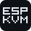
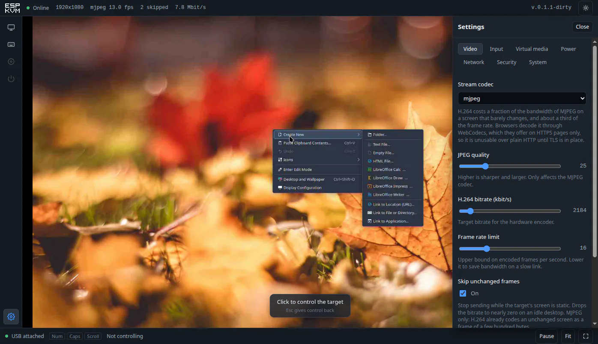
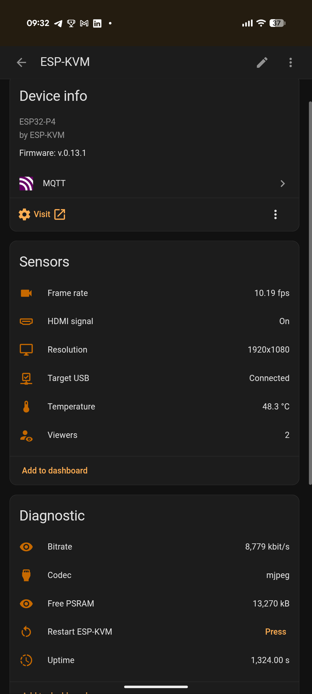
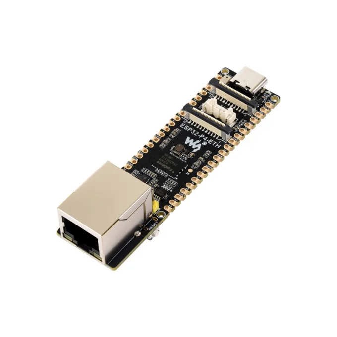
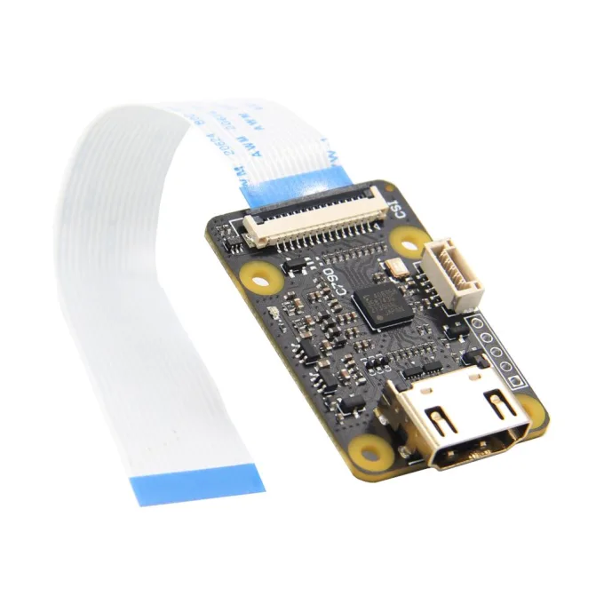

<p align="center">
  
</p>

# ESP-KVM

<p align="center">
  <a href="https://github.com/espkvm/espkvm/actions/workflows/firmware.yml"></a>
  <a href="https://github.com/espkvm/espkvm/releases/latest"></a>
  <a href="LICENSE"></a>
  
  
</p>

<p align="center">
  <a href="https://buymeacoffee.com/dexif"></a>
</p>

An IP-KVM built from an ESP32-P4 and a Toshiba TC358743 HDMI-to-CSI bridge. It
captures the target machine's HDMI output, presents itself to that machine as a
USB keyboard and mouse, and puts both in a browser.

The point is to reach a machine that has no working operating system - a BIOS
screen, a boot menu, a kernel that will not come up - from a device that costs a
fraction of a commercial KVM-over-IP.



> **Built on [jrowny/p4kvm](https://github.com/jrowny/p4kvm).** The hard part -
> bringing up the TC358743 and getting frames out of the ESP32-P4's CSI
> receiver - was solved there first, and this project would not exist without
> it. See [Credits](#credits).

## Status

Useful for what it does today, and honest about the rest.

| | |
|---|---|
| Video capture, following the target's resolution changes | works |
| MJPEG streaming | works |
| H.264 streaming | works; needs HTTPS in the browser (see below) |
| Keyboard, absolute and relative pointer, media keys | works |
| Pasting text with a keyboard layout | works |
| Use from a phone or tablet (touch trackpad and on-screen keyboard) | works |
| Multiple viewers, one in control at a time with takeover | works |
| User-defined key macros | works |
| Settings, capability reporting, diagnostics | works |
| Firmware update over the network, with rollback | works |
| HTTPS with a certificate the device issues itself | works; a downloadable CA you can trust to clear the warning and enable H.264 |
| Bring your own TLS certificate | works; install your own cert and key (Settings, or `PUT /api/v1/tls/cert`), self-signed by default |
| Login, and a physical password reset | works |
| Thermal protection | works |
| Virtual media: boot the target from a disk image | works; from a FAT32 card (up to 4 GB each) or a small image in the device's own flash |
| Guessing the target's OS from how it enumerates USB | works |
| Wake-on-LAN (magic packet to the target's MAC) | works |
| ATX power control (power/reset buttons and power LED through optocouplers) | works; wiring in [docs/wiring.md](docs/wiring.md) |
| Home Assistant integration over MQTT | works; off by default, auto-discovered sensors and power/reset/Wake-on-LAN buttons, TLS optional |
| VPN &mdash; WireGuard or native Tailscale | works; off by default, pick one in Settings &rarr; VPN. WireGuard is a split-tunnel client with on-device key generation; Tailscale joins a tailnet natively (a 100.x address reachable from anywhere, NAT traversal handled, no gateway or port-forward). Both share one WireGuard stack |
| HDMI audio | not implemented |

What is coming next is in the [roadmap](ROADMAP.md).

<p align="center">
  
</p>
<p align="center"><em>The device in Home Assistant &mdash; every value reported live over MQTT, discovered automatically.</em></p>

**Still: do not put this on the public internet.** There is a login now, and
TLS, but nothing here has been through a security review, and a device that
holds a keyboard on someone else's machine is worth more to an attacker than
most things on a network. Keep it on a network you trust, or reach it over a
VPN &mdash; it has both a built-in WireGuard client and native Tailscale
(Settings &rarr; VPN; enable one). Tailscale needs no port-forward, gateway or
VPS: the device joins your tailnet directly and is reachable at its 100.x
address (or MagicDNS name) from anywhere, with its TLS certificate valid over
the tailnet, and it relays through the DERP region nearest to it rather than a
fixed one. WireGuard is a split-tunnel client that generates its own key on the
device and shows the matching public key in the VPN tab to register on your hub.

## Hardware

Two boards joined by a CSI ribbon: an ESP32-P4 that does the work, and a
TC358743 bridge that turns the target's HDMI into a stream it can read.

<table>
<tr>
<td width="50%"></td>
<td width="50%"></td>
</tr>
<tr>
<td valign="top">

**The device - [Waveshare ESP32-P4-ETH](https://www.waveshare.com/esp32-p4-eth.htm)**

ESP32-P4 with 32 MB PSRAM, 32 MB flash, 100M Ethernet, a Raspberry-Pi-compatible
CSI connector, USB 2.0 OTG HS and a microSD slot. Another ESP32-P4 board with
Ethernet and the same CSI connector can run it too - the pins are set in
[menuconfig](docs/PORTING.md), not in the code. The Espressif ESP32-P4 Function
EV Board (chip rev v3.2) has its own build target; see [boards/](boards/README.md).

</td>
<td valign="top">

**The capture - [Geekworm C790](https://wiki.geekworm.com/C790)**

A TC358743 HDMI -> MIPI CSI-2 bridge that turns the target's HDMI output into a
camera stream the ESP32-P4 can read. Any other TC358743 capture board should do
just as well.

</td>
</tr>
</table>

**Cables:** a 15-pin CSI ribbon between the two boards, HDMI from the target,
and USB-C from the board's OTG port to the target. A microSD card if you want
boot-from-image.

<sub>Board photos (c) their makers, taken from the product pages linked above and
used only to identify the hardware. ESP-KVM is not affiliated with Espressif,
Waveshare or Geekworm. The pin map is in
`components/kvm_board/include/kvm_board.h`.</sub>

**The chip revision matters.** Below revision 3.0 several peripherals behave
differently - the colour conversion the H.264 encoder needs has to go through
the PPA, for one - and rev <3.0 and >=3.0 are mutually exclusive build targets.
The default build (`sdkconfig.defaults`) selects the pre-3.0 family, so a v1.x
part builds and runs as shipped; a rev 3.x board is built from its own overlay
(see [boards/](boards/README.md)). What was measured on the board in front of
us, including the documented claims that turned out to be false, is written down
in [docs/HARDWARE-NOTES.md](docs/HARDWARE-NOTES.md).

## Quick start

Download your board's `espkvm-<version>-<board>-merged.bin` (for example
`-waveshare-`) from the
[releases](https://github.com/espkvm/espkvm/releases) and write it at offset 0
with [esptool](https://github.com/espressif/esptool) - one file, no unpacking:

```sh
esptool --chip esp32p4 -b 921600 write-flash 0x0 espkvm-<version>-<board>-merged.bin
```

(The `-full-flash.zip` holds the same image as separate parts for tooling that
wants them; for a manual flash the single merged image is simpler.)

Then connect Ethernet, HDMI from the target, and the USB-C OTG port to the
target. The device announces itself over mDNS: open **https://espkvm.local/**.

The device is its own certificate authority - it generates a CA on first boot
and signs its own certificate with it - so the browser warns the first time.
Accepting the warning is enough to sign in and watch the MJPEG stream. For H.264
and for the keyboard and mouse, though, the browser needs a real *secure
context*, which a self-signed certificate does not give until it is trusted: the
WebSocket channel and the H.264 decoder (WebCodecs) will not run otherwise.

To trust the device once and clear the warning for good, download its CA -
**Settings -> Security -> Download CA certificate**, or `http://espkvm.local/cert.pem`
(served in the clear so you can fetch it before trusting anything) - import it
into your operating system or browser's **trusted authorities** (not "your
certificates"), and reach the device by name at **https://espkvm.local**. On a
static IP the certificate names the address too, so `https://<ip>` works after
importing; on DHCP use the name.

Sign in as **admin / admin**. The console will not go any further until that
password is changed: a KVM left on the password it shipped with is a keyboard
on someone else's machine, offered to whoever finds it.

After that the cable is only needed if something goes badly wrong - updates are
installed from the console itself.

## Building from source

The web console lives in a submodule ([espkvm/console](https://github.com/espkvm/console)),
so clone with `--recursive` (or run `git submodule update --init` in an existing
clone):

```sh
git clone --recursive https://github.com/espkvm/espkvm
tools/install-idf.sh                          # ESP-IDF 6.0.1, once
. tools/env.sh
cd web && npm ci && npm run build && cd ..    # the console is embedded in the firmware
idf.py build
idf.py -p /dev/ttyACM0 -b 921600 flash
```

There is no `menuconfig` step for the default board: everything it needs is in
`sdkconfig.defaults`. To build for another board, apply its overlay - see
[boards/](boards/README.md).

The console can also be developed against a simulated device, with no hardware
attached at all:

```sh
cd web && npm run dev:mock
```

## How it works


**Video.** The bridge is polled for signal state and timings, so a target
switching from an 800x600 firmware screen to a 1080p desktop is followed
without intervention. Encoding is done by hardware - the JPEG engine, or the
H.264 encoder with the PPA converting colour on the way in.

Measured at 1080p on this hardware:

| | MJPEG | H.264 |
|---|---|---|
| Frame rate | 20 fps | 5-7 fps |
| Idle screen | 0 kbit/s (unchanged frames are dropped) | 170 kbit/s |
| Screen in motion | 8.5 Mbit/s | ~500 kbit/s |

H.264 is therefore not the faster option; it is the one that fits down a narrow
link. Browsers decode it through WebCodecs, which they expose on secure pages
only - over plain HTTP no browser can play it, however new. Turn HTTPS on and
it works; the console says exactly that when it cannot.

**Those are this board's numbers, not the ceiling.** The chip here is revision
v1.3, and below revision 3.0 the CSI receiver cannot deliver YUV420 while the
H.264 encoder refuses RGB - so every frame detours through the pixel
accelerator to change colour space, which is 76 ms of the 145 ms a 1080p frame
costs. Revision 3.0 and later removes that detour: the capture path can hand
the encoder what it wants directly. That is untested here for want of the
silicon, but it rests on a revision check in Espressif's own driver rather than
on hope - see [docs/HARDWARE-NOTES.md](docs/HARDWARE-NOTES.md). There is room
on our side too: the conversion and the encode run one after the other in the
same task where they could overlap.

**Input.** A composite USB HID device: a boot-protocol keyboard that firmware
screens understand, an absolute pointer so a click lands where it was aimed
regardless of the target's mouse acceleration, a relative pointer for software
that captures the cursor, and consumer keys. Everything is released when the
browser goes away, so a dropped connection cannot leave a key held down on the
target.

**Target OS.** How a machine enumerates a USB device is a fingerprint - Windows
asks for a Microsoft OS descriptor, macOS reads each string twice, Linux does
not - so the console guesses whether the target is Windows, macOS, Linux or
Android and shows it next to the USB status, with the raw request trace behind a
click. That guess is what the console follows when it offers OS-specific key
combinations (the Linux magic-SysRq sequences, Task Manager on Windows) and when
it labels the Meta key Win, Cmd or Super. A `Target OS` setting overrides it, for
when the guess is wrong or the target never showed enough to tell; if it reads a
machine wrong, that trace is what to send so a later build can learn it.

**Every feature is optional.** Each one reports whether it is compiled in,
whether the hardware supports it, and whether it is switched on. A control the
hardware cannot support is shown disabled, carrying the device's own
explanation, rather than hidden or left to fail silently. `GET
/api/capabilities` is that registry.

**Virtual media.** A disk image is presented to the target as a USB drive it can
boot from - a rescue system, an installer, a live image. The console lists what
is available and lets you pick which one the target sees, from two places at
once. Images on a **microSD card** are served read-only: this board reads the
card reliably but cannot write it at a useful speed, so the card is prepared in
an ordinary reader (format it FAT32, up to 4 GB per file, a FAT32 limit). A small
image can also live in the **device's own flash** - a 4 MB partition, enough for
iPXE, memtest or a DOS floppy, and no card needed. Flash writes are reliable
here, so that one can be uploaded from the browser (or written over the cable
with `tools/fetch-rescue.sh`, which fetches netboot.xyz by default). The flash
partition ships empty; adopting the partition table that carries it is a one-time
full flash (the browser flasher does it), after which the image updates over the
network.

**Security.** The device serves HTTPS with a certificate it issues itself on
first boot, and asks for a password before it will do anything. The password is
stored as a salted PBKDF2 hash, sessions are HttpOnly cookies held in memory -
so a reboot signs everyone out - and repeated failures pay a growing delay.

A forgotten password is cleared by holding the board button through a power-on
or reset: physical presence is the credential, because whoever can hold that
button can also unplug the machine this device is attached to. Only the password
is erased; the network settings stay, since wiping those would make a locked
device unreachable rather than recovered.

**Heat.** The chip is watched, and if it ever gets hot the frame rate is halved
and then encoding stops - but the keyboard, the mouse and the web interface keep
running. A KVM that stops accepting keystrokes because it is warm has failed at
the job it was bought for, at exactly the moment someone is using it to fix
something. On this board it does not come up in practice: 1080p at full rate
settles around 46 C in open air, against thresholds of 70 and 85.

**Updates.** Two app slots and automatic rollback: an image that fails to come
up returns the device to the one that worked - which matters on a device that
is often the only way to reach the machine it is attached to. The console can
check for a published build and install it in one click; the browser does the
fetching, and the device never reaches out to the internet on its own.

## Interface

A Vue 3 console served from the device as a single gzipped file of about 50 KB,
with no external fonts, scripts or requests: the device has to work on a network
with no way out.

## API

Everything the console does is available over HTTP.

| | |
|---|---|
| `GET /api/capabilities` | what this device can do, and why it cannot do the rest |
| `GET /api/v1/settings`, `PUT` | settings, validated and applied as a whole |
| `GET /api/v1/settings/schema` | title, range and help text for every setting |
| `GET /api/v1/video/status` | resolution, frame rate, bitrate, encoder load, viewers |
| `GET /api/v1/system/usbprobe` | the target's USB enumeration fingerprint and the OS guessed from it |
| `GET /api/v1/storage/images` | disk images on the card and in flash, and which one is active |
| `POST /api/v1/storage/upload`, `/rescue`, `/delete` | manage the virtual-media images |
| `POST /api/v1/power/wake` | send a Wake-on-LAN magic packet to the target's MAC |
| `POST /api/v1/power/click`, `/hold`, `/reset` | ATX: tap power, hold power for a hard off, tap reset |
| `GET /api/v1/system/info` | version, uptime, free memory, chip temperature, thermal state, Ethernet link, ATX power state |
| `POST /api/v1/system/update` | firmware image, written to the spare slot |
| `POST /api/v1/system/restart` | restart, for settings that need one |
| `GET /api/v1/auth/session` | whether a login is required, and who is signed in |
| `POST /api/v1/auth/login`, `/logout`, `/password` | the session, and changing the password |
| `GET /stream` | MJPEG as `multipart/x-mixed-replace`; answers 409 while H.264 is selected |
| `GET /cert.pem` | the device's CA certificate, to import and trust the device (also on port 80) |
| `WS /video` | video frames, JPEG or H.264, behind a 12-byte header |
| `WS /ws` | keyboard and pointer |

## Repository layout

```
components/
  tc358743/       HDMI bridge driver, EDID profiles
  video_pipeline/ CSI capture, MJPEG and H.264 codecs, published frame store
  kvm_hid/        composite USB HID
  kvm_storage/    microSD and on-flash rescue image, virtual media
  kvm_config/     settings registry and capability registry
  kvm_web/        HTTP/HTTPS server, REST API, WebSockets, TLS identity
  kvm_net/        Ethernet, mDNS, Wake-on-LAN, WireGuard tunnel
  kvm_board/      pin map
web/              the console (Vue 3 + TypeScript + Vite)
boards/           per-board build overlays (Waveshare, Function EV)
tools/            toolchain setup, EDID generation, hardware probes
docs/             what the hardware actually does
```

## Credits

This project exists because of **Jonathan Rowny** and his
**[p4kvm](https://github.com/jrowny/p4kvm)** proof of concept. He was the one
who got an ESP32-P4 to pull frames off a TC358743 at all, and put it out in
the open with a working [demonstration](https://youtu.be/f21f6RnW5Yc) for
anyone to build on. This is that thing built on. Start with his repository and
his video; everything here stands on them.

The history was not carried over into this repository, so the debt is recorded
here instead, and it is a real one. Two pieces of that work represent reverse
engineering that no datasheet would have handed us:

- **the TC358743 bring-up sequence** - PLL dividers, MIPI timing counters, the
  order in which hotplug and the CSI transmitter have to be brought up. One
  wrong register and the result is a black screen with nothing to debug;
- **direct programming of the ESP32-P4's `MIPI_CSI_BRIDGE` registers**, which
  the `esp_cam_ctlr` API does not expose. Espressif's examples target ordinary
  camera sensors, not an HDMI bridge.

Both still carry this firmware. The layers above them - HTTP, WebSockets, HID,
the interface - were rewritten, and the aim is different: p4kvm is explicit
about being a proof of concept, while this tries to be a KVM you would leave
installed. Thank you, Jonathan, for publishing it.

The register sequence also follows the Linux kernel driver
`drivers/media/i2c/tc358743.c` and Toshiba's TC358743XBG functional
specification.

The interface icons follow the Feather and Lucide conventions closely enough
that those sets deserve the credit; see [NOTICE](NOTICE).

A 3D-printed enclosure for the original parts is published by jrowny on
[MakerWorld](https://makerworld.com/en/models/2961981-esp32-p4-ip-kvm-enclosure).

## Support

ESP-KVM is free and open source. If it saved you a trip to a dead machine and you
want to say thanks, you can [buy me a coffee](https://buymeacoffee.com/dexif) -
entirely optional, and contributions of code, issues and ideas are just as
welcome.

## Licence

Apache-2.0, the same licence p4kvm and ESP-IDF use. See [LICENSE](LICENSE) for
the text and [NOTICE](NOTICE) for the attribution it requires.

One licence for the whole repository, deliberately: the files inherited from
p4kvm have to stay Apache-2.0 whatever the rest does, and a split would mean
every new file needs someone to remember which side it falls on. Apache also
carries an explicit patent grant from contributors, which MIT does not - worth
having on a hardware project, though it says nothing about third-party patents:
H.264 is encumbered no matter what licence sits on this code.
