<p align="center">
  
</p>

# ESP-KVM

<p align="center">
  <a href="https://github.com/espkvm/espkvm/actions/workflows/firmware.yml"></a>
  <a href="https://github.com/espkvm/espkvm/releases/latest"></a>
  <a href="LICENSE"></a>
  
  
  <br>
  <a href="https://t.me/espkvm"></a>
  <a href="https://x.com/espkvm"></a>
  <a href="https://github.com/orgs/espkvm/discussions"></a>
  <a href="https://github.com/orgs/espkvm/discussions/65"></a>
  <br>
  <a href="https://www.producthunt.com/products/esp-kvm?embed=true&amp;utm_source=badge-featured&amp;utm_medium=badge&amp;utm_campaign=badge-esp-kvm"></a>
</p>

Like remote desktop, except it does not run on the machine. A small board plugs
into that machine's HDMI output and a USB port, and serves its screen, keyboard
and mouse to a browser. So it still works where remote desktop cannot: a BIOS
screen, a boot menu, a kernel that will not come up, a machine with no operating
system on it at all.

That is an IP-KVM. This one is built from an ESP32-P4 and a Toshiba TC358743
HDMI-to-CSI bridge, and costs a fraction of a commercial KVM-over-IP.

New to the idea? [What an IP-KVM is, and why you might want one](https://espkvm.io/blog/what-an-ip-kvm-is/)
&mdash; what remote desktop cannot do, and where people actually use this.

<p align="center">
  <b><a href="https://espkvm.io/flash/">Flash a board from the browser &rarr;</a></b>
  &nbsp;&middot;&nbsp;
  <a href="https://demo.espkvm.io/">Try the console</a>
  &nbsp;&middot;&nbsp;
  <a href="#quick-start">Quick start</a>
</p>

<!-- The buttons sit below the description on purpose: a search engine quotes the
     first prose in this file, and that should say what the project is rather than
     ask for a star. The ask itself lives in Support, at the bottom. -->
<p align="center">
  <a href="https://github.com/espkvm/espkvm"></a>
  &nbsp;
  <a href="https://buymeacoffee.com/dexif"></a>
</p>

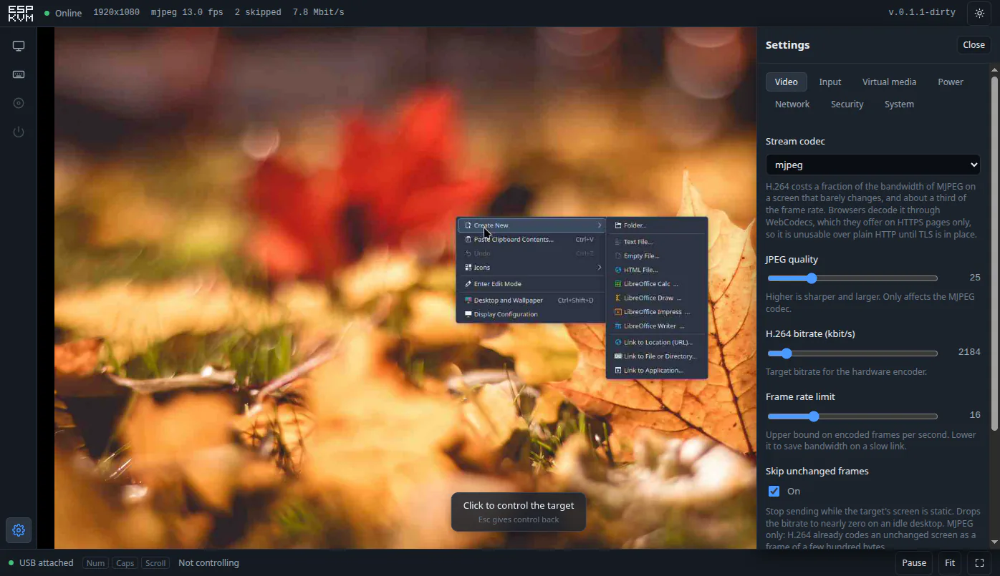

**From whatever you have to hand.** The console is a web page, so the machine
you drive the target from can be a laptop, a phone or a tablet - nothing to
install on either end. Touch gets a trackpad and an on-screen keyboard rather
than a shrunken desktop, the page can be installed from the browser to run
full-screen like an app, and where the link is too thin for video the screen
comes through as text.

<!-- TODO: one image of the console on a laptop, a phone and a tablet side by
     side. It is the fastest way to say "any device" and the table cannot. -->

> **Built on [jrowny/p4kvm](https://github.com/jrowny/p4kvm).** The hard part -
> bringing up the TC358743 and getting frames out of the ESP32-P4's CSI
> receiver - was solved there first, and this project would not exist without
> it. See [Credits](#credits).

## Status

Useful for what it does today, and honest about the rest.

| | |
|---|---|
| Video capture, following the target's resolution changes | works |
| MJPEG streaming | works |
| H.264 streaming | works; needs HTTPS in the browser |
| Keyboard, absolute and relative pointer, media keys | works |
| Alt+Tab, Ctrl+W and the Windows key reaching the target | works in Chrome and Edge; full screen, with control taken, and the "All keys" button on. Firefox and Safari have no way to give a page those keys |
| Waking a sleeping target from the keyboard | works; over USB, if the machine allows it. Otherwise Wake-on-LAN or the ATX button |
| Pasting text with a keyboard layout | works; US English, Russian, Czech, Ukrainian, Lithuanian |
| Use from a phone or tablet | works; touch trackpad and on-screen keyboard |
| Multiple viewers, one in control at a time with takeover | works |
| User-defined key macros | works; the commands are in [docs/SCRIPTS.md](docs/SCRIPTS.md) |
| Runbooks: a macro that waits for words on the screen, run on the device | works; `wait Press F2`, then `key f2`. Carries on with the browser closed, and each one is a button in Home Assistant. Text screens only. [docs/SCRIPTS.md](docs/SCRIPTS.md) |
| Scheduler: fire an action on a cron timetable | works; Wake-on-LAN in the morning, a runbook overnight, a reset on a schedule. Needs the clock, set over the network |
| Push notifications, with a screenshot | works; to Telegram (with the screen on the MJPEG codec) or a webhook, when a watched phrase appears or the screen goes blank |
| Settings, capability reporting, diagnostics | works |
| Settings to a file, and back | works; no secrets in the file, and a device's own identity is left alone |
| Firmware update over the network, with rollback | works |
| HTTPS with a certificate the device issues itself | works; the CA is downloadable, which also enables H.264 |
| Bring your own TLS certificate | works; Settings, or `PUT /api/v1/tls/cert` |
| Login, two-factor sign-in, and a physical password reset | works; the second factor is a TOTP app, with eight recovery codes |
| Thermal protection | works |
| Virtual media: boot the target from a disk image | works; from a microSD card (FAT32 or exFAT, MBR or GPT), or a small image in the device's own flash |
| Recording the screen to the microSD card, and screenshots | works; the stream the viewers already get, so nothing is encoded twice. A panel lists them, plays them and downloads them |
| A dashcam: the last minutes kept, saved when something happens | works; in memory, or on the card for boards short of PSRAM. Saves an MP4 with chapters on a stop screen, a watched phrase, the power going off, or a button - and sends it to Telegram |
| Timelapse | works; one frame every few seconds, played back at 25 fps |
| Searching a recording for what was on the screen | works; the screen's text is saved beside the video and the panel plays from the moment. Character modes only |
| Reading a text screen as text (BIOS, boot loader, console) | works; select and copy with the mouse, or read the screen *instead* of the video - a couple of kilobytes where a picture will not fit. Character modes only, and the characters are matched against the fonts a BIOS, a UEFI console and a Linux console draw with - a machine drawing with some other font reads as nothing rather than as a guess |
| Noticing a screen that is one flat colour | works; a stop screen or a blanked output has no characters, but it is one colour and it stays |
| Watching the screen for words while nobody is looking | works; off by default. Give it phrases, it alerts in the log and in Home Assistant |
| Guessing the target's OS from how it enumerates USB | works |
| Wake-on-LAN | works |
| A gamepad for a console (Switch, Steam Deck, Windows) | works on a Switch (Settings &rarr; Input &rarr; Gamepad &rarr; switch_alone); the wired Xbox 360 pad for Windows and a Steam Deck is not tried on hardware yet. The console gets a gamepad panel or an overlay over the picture, and a controller on your own computer works through it ([clip](https://www.youtube.com/watch?v=UCSkzGHSKWI)) |
| HDMI-CEC: see the source, send it remote keys, standby and wake | works on boards with a TC358743 capture chip; the device acts as a TV. Only media boxes, consoles, a Raspberry Pi and the like speak CEC - an ordinary PC does not. Tried with a Steam Deck in its dock: name, remote keys in the Steam menus and standby work, wake does not ([clip](https://www.youtube.com/watch?v=hXiaOugYkVM)) |
| A battery-backed clock chip | optional; with one fitted the device knows the time after a restart with no network - file names and two-factor codes need it. A DS3231 (DS3231M, DS3232) works and shows its thermometer too; a PCF8563 / BM8563, PCF85063 or PCF8523 is supported from the datasheet but not tried yet. Found by itself on the capture board's I2C bus, or chosen with its own pins in Settings &rarr; System &rarr; Clock. A DS1307 is not used |
| WiFi - station or its own access point | works; on boards with an ESP32-C6, or an ESP32-C5 for 5 GHz. A rescue hotspot and a captive portal |
| Ethernet with WiFi as the backup | works on boards with both; Connection &rarr; Auto. When the cable is pulled the device moves to WiFi, and back when it returns, with no restart. It answers on both addresses, and the certificate names both. Tried on the Function EV: the console stayed open over WiFi and MQTT came back in 15 s |
| ATX power control (power, reset, power LED) | works; wiring in [docs/wiring.md](docs/wiring.md) |
| The target's serial console | new, not tried on hardware yet; Settings &rarr; Power &rarr; Serial console. A UART on two pins you pick, a VT100 terminal in the console that keeps the boot messages, and a REST tail for scripts. 3.3 V consoles wire straight in, RS-232 through a MAX3232 module; [docs/wiring.md](docs/wiring.md#serial-console) |
| The target's log over the network (netconsole / syslog) | new, not tried on hardware yet; Settings &rarr; Network &rarr; Netconsole. The device listens on UDP, keeps 64 KB, shows it live and can notify on phrases like "Kernel panic". No wiring, and it works when the target's disk is gone. The lines are unauthenticated, so they only ever raise a notification, never an action |
| The device's own log, live | new; Diagnostics &rarr; Live log. 64 KB that follows as lines arrive, with levels and search; the download still has the run before a restart |
| Small status display (IP, link, capture, health) | works; optional. An I2C OLED or a round GC9A01, pins assigned from the console, and the picture can be turned upside down for a panel mounted that way |
| A viewing token for dashboards | works; off until you make one. Opens the stream and the figures, and nothing that can touch the target |
| Home Assistant integration over MQTT | works; off by default, auto-discovered. Sensors, buttons, an update entity, a camera holding a still of the screen |
| VPN - WireGuard or native Tailscale | works; off by default, pick one in Settings. Tailscale needs no port forward or gateway |
| HDMI audio | not implemented; the bridge offers it as I2S, but the wires and the code are missing |

What is coming next is in the [roadmap](ROADMAP.md).

<p align="center">
  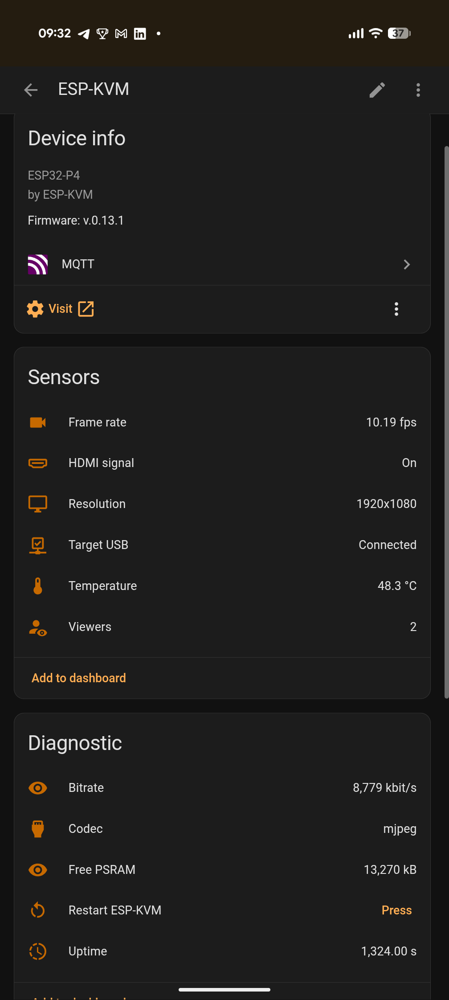
</p>
<p align="center"><em>The device in Home Assistant &mdash; every value reported live over MQTT, discovered automatically.</em></p>

**Still: do not put this on the public internet.** There is a login now, and
TLS, and the code has been through a security review of my own - but not an
external audit, and a device that holds the keyboard of someone else's machine
is worth attacking. Two things I would fix before exposing one anywhere:
secure boot and flash encryption are not switched on, so physical access to the
board gives up the TLS key and the network passwords, and OTA images are not
signature-checked, so anyone with a session can flash anything. Keep it on a
network you trust, or reach it over a VPN. It has two built in, in Settings
&rarr; VPN.

Tailscale needs no port forward, no gateway and no VPS: the device joins your
tailnet and answers at its 100.x address, or its MagicDNS name, from anywhere.
Its certificate is valid there too. WireGuard is a split tunnel - it makes its
own key on the device and shows the public half in the VPN tab, to register on
your hub.

## Hardware

An ESP32-P4 board does the work, a TC358743 bridge turns the target's HDMI into a
stream it can read, and a CSI ribbon joins the two. The C790 has both kinds of
camera connector - a 15-pin 1.0 mm one (the Raspberry Pi 4 kind) and a 22-pin
0.5 mm one (the Pi 5 / Zero kind) - and comes with a ribbon for each, so use the
one that fits the board. An optocoupler module
is an optional add-on for ATX power control.

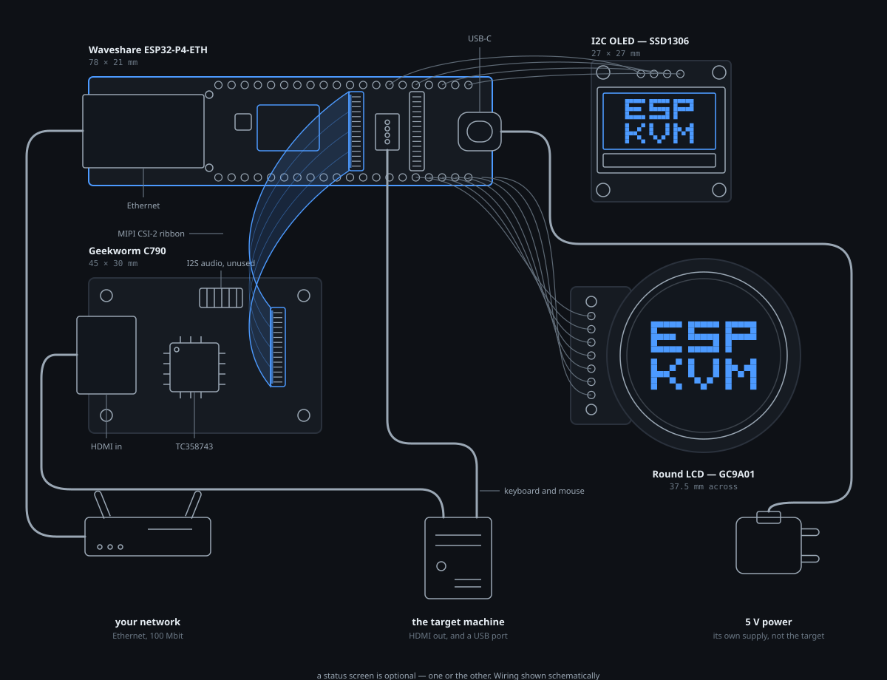

### The device — pick one ESP32-P4 board

<table>
<tr>
<td width="50%">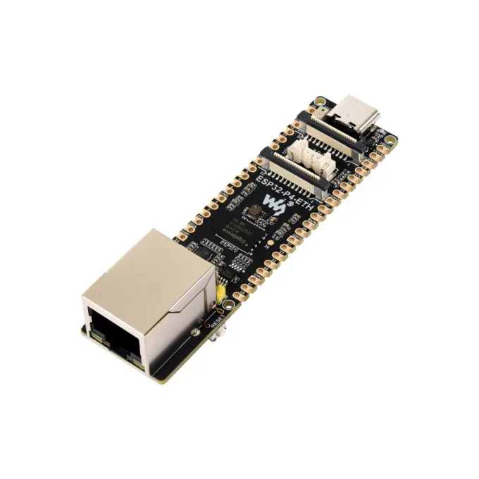</td>
<td width="50%">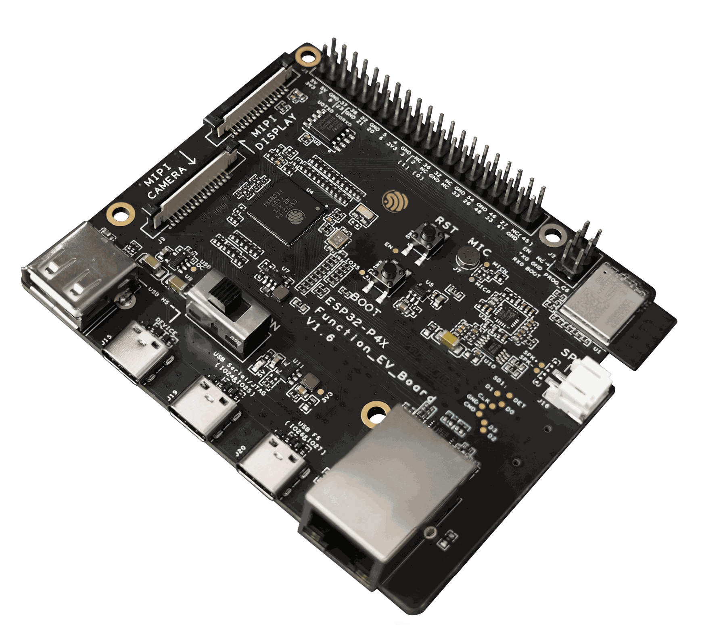</td>
</tr>
<tr>
<td valign="top">

**[Waveshare ESP32-P4-ETH](https://www.waveshare.com/esp32-p4-eth.htm)** &mdash; chip rev v1.3, the default

ESP32-P4 with 32 MB PSRAM, 32 MB flash, 100M Ethernet, a **22-pin 0.5 mm** CSI
connector (the Pi 5 / Zero kind - the C790's rear connector and its 22-pin
ribbon), USB 2.0 OTG HS and a microSD slot. Built by plain `idf.py build`.

</td>
<td valign="top">

**[Espressif ESP32-P4 Function EV Board](https://docs.espressif.com/projects/esp-dev-kits/en/latest/esp32p4/esp32-p4x-function-ev-board/user_guide.html)** &mdash; chip rev v3.2 here; earlier units are rev 1.x

Espressif's own board, with an onboard ESP32-C6 &mdash; so it also does WiFi
(station, access point, and the rescue hotspot). Its own build target
(`boards/funcev_p4.defaults`), and the [browser flasher](https://espkvm.io/flash/)
offers it directly. The rev 3.2 silicon feeds native YUV422 straight into the
H.264 and JPEG encoders (no PPA colour-convert pass), which frees ~4 MB of PSRAM
for a deeper capture ring and lifts 1080p to a little over 20 fps.

</td>
</tr>
</table>

Any other ESP32-P4 board with Ethernet and the same CSI connector can run it too
&mdash; the pins are set in [menuconfig](docs/PORTING.md), not in the code.

**What rules a board out.** Being an ESP32-P4 board is not enough. It needs
**32 MB of PSRAM** (the frame buffers are allocated once for the largest mode:
12.5 MB at 1080p on rev 3.x, 11.9 MB on rev <3.0, before the H.264 encoder asks
for its reference frame - 8 MB cannot hold them), **16 MB of flash** (two OTA
slots and the rescue image), a **camera connector the bridge can reach** (two
CSI-2 lanes, plus 3.3 V and I2C on it or somewhere to wire them from - some
boards bring only 1.8/2.8 V sensor rails and shift the I2C down with them),
**USB OTG-HS on a port or a header** rather than only on an edge connector, and
**a way onto the network** - an Ethernet PHY or an onboard ESP32-C6. The
[LILYGO T-Halow P4](https://lilygo.cc/en-us/products/t-halow-p4) is the worked
example of a board that looks right and misses four of the five: 8 MB PSRAM,
RMII and USB OTG only on its M.2 edge, and no 3.3 V on its camera FPC.

**The chip revision matters.** Below revision 3.0 several peripherals behave
differently and rev <3.0 and >=3.0 are mutually exclusive build targets. On rev
<3.0 the colour conversion the H.264 encoder needs goes through the PPA; on rev
>=3.0 the encoders take the captured YUV422 (or RGB) directly and the PPA is not
used. The default build (`sdkconfig.defaults`) selects the pre-3.0 family, so a
v1.x part builds and runs as shipped; a rev 3.x board is built from its own
overlay (see [boards/](boards/README.md)). What was measured on the boards in
front of us, including the documented claims that turned out to be false, is
written down in [docs/HARDWARE-NOTES.md](docs/HARDWARE-NOTES.md).

To tell the revision before flashing, read the chip: **ESP32-P4NRW32X**, with
an X at the end, is rev 3.x; **ESP32-P4NRW32** without it is rev 1.x. On the
chip itself the second character of the manufacturing code is the revision: C
for v1.0, E for v1.3, F / G / H for v3.0 / v3.1 / v3.2
([Espressif's table](https://docs.espressif.com/projects/esp-chip-errata/en/latest/esp32p4/01-chip-identification/index.html)).
The product code of the board does not tell - the same board ships with either.
The number in the part name is the PSRAM in megabytes: an **NRW16** or
**NRW16X** chip has 16 MB, less than the first point above asks for, and has
not been tried.

### More boards, run on real hardware

Each of these has had this firmware on it, on someone's bench. The first four
carry an ESP32-P4, a MIPI-CSI connector, USB OTG-HS and an onboard ESP32-C6; the
M5Stack unit is the exception on every count but the P4 itself - no
WiFi, and its capture arrives on a flat cable of its own. Most units tested were
pre-3.0 silicon, so the overlays build for that by default and a rev 3.x unit
takes the `-rev3` image instead.

<table>
<tr>
<td width="50%">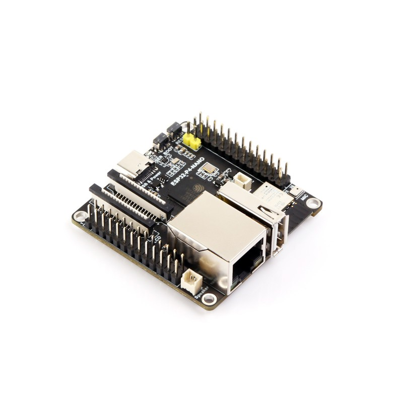</td>
<td width="50%">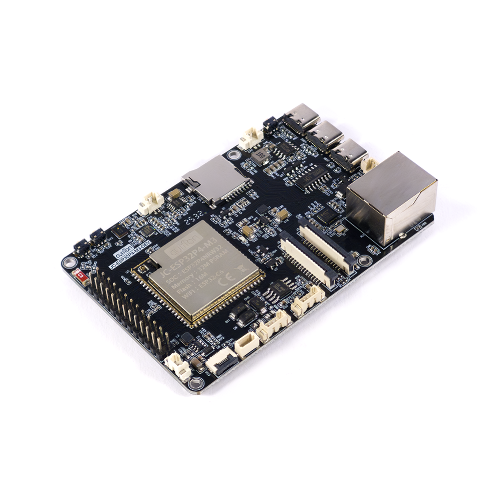</td>
</tr>
<tr>
<td valign="top">

**[Waveshare ESP32-P4-NANO](https://www.waveshare.com/esp32-p4-nano.htm)**

Same IP101 Ethernet and onboard ESP32-C6 as the boards above; 32 MB PSRAM, 16 MB
flash. Contributors confirmed capture, USB and Ethernet on both revisions, and
WiFi on rev 3.1. Its OTG-HS port is a USB-A socket that drives its own 5 V, so
the lead to the target must be an A-to-A cable with the 5 V wire cut. Build
overlay: `boards/nano_p4.defaults`, or `boards/nano_p4_rev3.defaults` on rev 3.x
silicon - it ships as either revision under one product code.

</td>
<td valign="top">

**Guition ESP32-P4-M3-Dev (JC-ESP32P4-M3)**

A display board (4.3&Prime; MIPI-DSI touch, unused by the KVM) that also carries
Ethernet and an ESP32-C6; 32 MB PSRAM, 16 MB flash. Confirmed by a contributor.
Two USB-C ports - the target goes on the OTG-HS one. The capture board's ribbon
goes into **J3**, not J2 ([#61](https://github.com/espkvm/espkvm/issues/61)). Build overlay:
`boards/guition_p4.defaults`, or `boards/guition_p4_rev3.defaults`.

</td>
</tr>
</table>

<table>
<tr>
<td width="50%">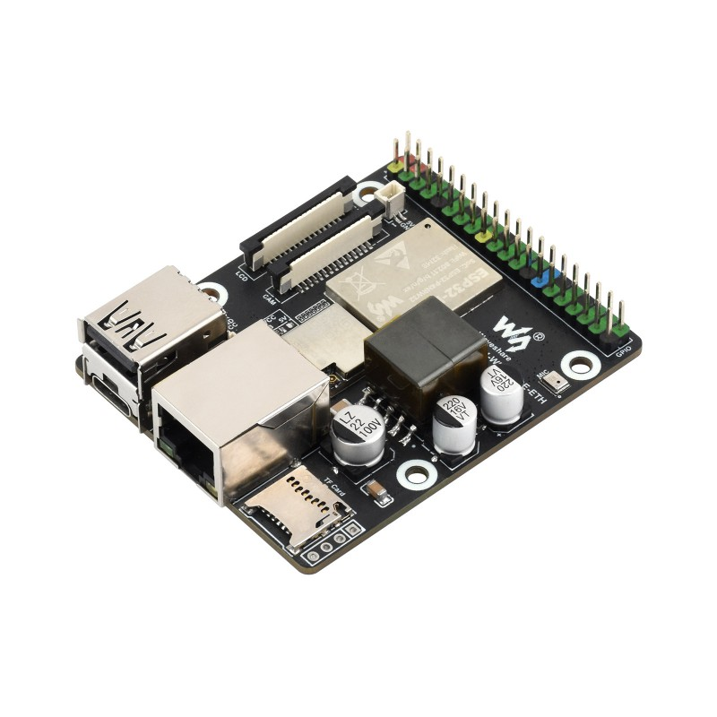</td>
<td width="50%">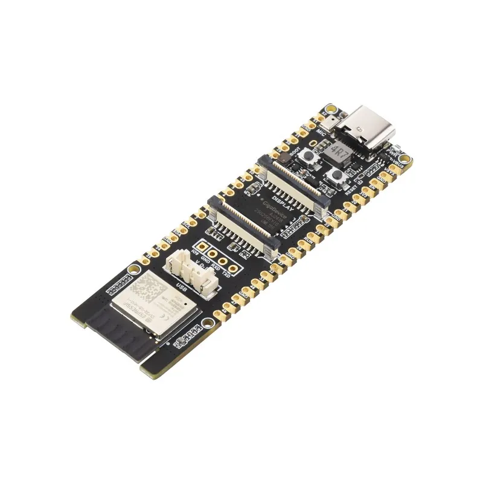</td>
</tr>
<tr>
<td valign="top">

**[Waveshare ESP32-P4-WIFI6-POE-ETH](https://www.waveshare.com/esp32-p4-wifi6-poe-eth.htm)**

The first supported board that takes **PoE**, so a KVM in a rack needs one cable
instead of two. Same IP101 Ethernet, same microSD wiring and the same ESP32-C6
over SDIO as the boards above; 32 MB PSRAM, 32 MB flash, and a full-size USB-A
port for the target. Confirmed by [@deltorek112](https://github.com/deltorek112)
on rev 3.x silicon with the `p4-poe-rev3` image: 1080p over H.264 at 23 fps,
through a Waveshare HDMI to CSI Adapter
([issue #51](https://github.com/espkvm/espkvm/issues/51)). Build overlay:
`boards/poe_p4.defaults`, or `boards/poe_p4_rev3.defaults`.

Waveshare said in August 2026 that these ship rev 1.3, but the one tested was
rev 3.x - **check the boot log before flashing**: it prints `chip revision: v3.1` (or v1.3), and a
rev 3.x board wants the `-rev3` build. The pre-3.0 image has not been run on
this board yet.

</td>
<td valign="top">

**[Waveshare ESP32-P4-WIFI6](https://www.waveshare.com/esp32-p4-wifi6.htm)**

The PoE board without its wired half, contributed by
[@nwomn](https://github.com/nwomn), who has one: capture through the C790 and the
USB keyboard and mouse both work, and the header is checked against the board.
32 MB PSRAM, 32 MB flash. Build overlay: `boards/waveshare_p4_wifi6.defaults`.

WiFi is the only link it has, and it used to stall: the board pulls its SDIO
lines up through 51k where Espressif ask for 10k, which lost the co-processor's
data-ready interrupt. Since 0.41.1 the chip's own pull-ups are on for this board
and it holds. That is one board and one tester -
[issue #27](https://github.com/espkvm/espkvm/issues/27) if yours differs. USB
OTG-HS is on an **MX1.25 4-pin header**, so the target needs an MX1.25-to-USB-A
cable.

</td>
</tr>
</table>

<table>
<tr>
<td width="50%">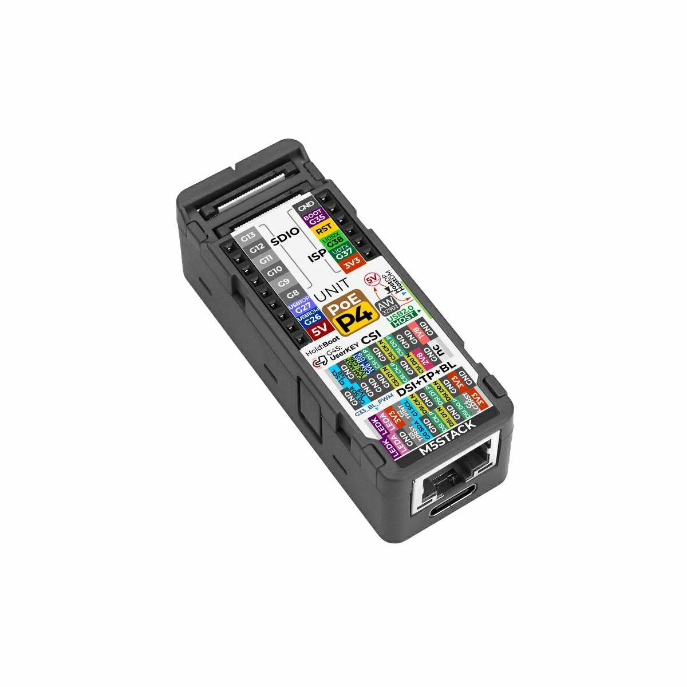</td>
</tr>
<tr>
<td valign="top">

**[M5Stack Unit PoE-P4](https://docs.m5stack.com/en/unit/Unit_PoE-P4)** &mdash;
*the smallest complete one*

The smallest of the lot, and the only one where the capture board is not a C790:
M5Stack's own **[Add-on Display In](https://shop.m5stack.com/products/add-on-display-in-for-poe-p4-lt6911d)**
plugs onto its 24-pin FPC and brings a microSD slot with it. 32 MB PSRAM, 16 MB
flash, the same IP101 Ethernet on the same GPIOs as the P4-ETH, 802.3at PoE.

The add-on's bridge is a **Lontium LT6911D**, not a TC358743, and it works.
Measured on hardware: at 1280&times;720 about 22 fps over MJPEG and 17 over
H.264; at 1920&times;1080 about 9 and 6. 720p is the mode to give it - the
conversion its bridge needs costs four times less there. One thing about it is unlike every other board here: its reset line is
active high, the opposite way round from a TC358743. Otherwise it behaves - it
measures the source's mode itself, so changing the resolution on the machine at
the other end is all it takes.

H.264 works here too - 15 frames a second at 720p, 6 at 1080p, each for about a
third of MJPEG's bandwidth. The **Unit PoE-P4** sold today is pre-3.0
(`boards/m5_poe_p4.defaults`). There is also an image for the same unit on
rev 3.x silicon (`boards/m5_poe_p4x.defaults`, "PoE-P4X"), which would pay
neither cost - but M5Stack does not list such a unit yet, nobody has run it,
and the colour order of its picture on rev 3.x is untested.

</td>
</tr>
</table>

<table>
<tr>
<td width="50%">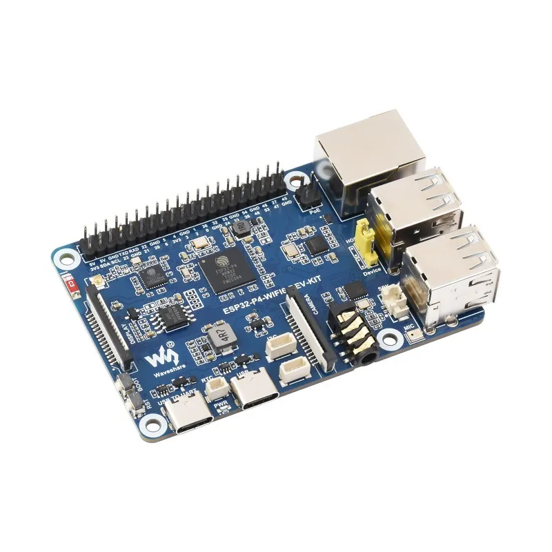</td>
</tr>
<tr>
<td valign="top">

**[Waveshare ESP32-P4-WIFI6-DEV-KIT](https://www.waveshare.com/esp32-p4-wifi6-dev-kit.htm)**

Both links on one board: 100M Ethernet on a PoE-capable magjack, and an ESP32-C6
for WiFi 6. Every pin that matters is the same as the boards above - Ethernet as
on the P4-ETH, the C6 on GPIO 14-19, the card slot's power gate on GPIO 45;
32 MB PSRAM, 16 MB flash. Confirmed by
[@brooklyn5w4g](https://github.com/brooklyn5w4g) on a v1.2 board with a rev 3.1
chip: H.264 at about 23 fps. Build overlay: `boards/wifi6devkit_p4.defaults`, or
`boards/wifi6devkit_p4_rev3.defaults`.

A jumper switches the P4's USB between USB-A **port 1** and a hub on ports 2-4,
and the target goes on port 1 with an A-to-A cable. Waveshare swapped the
jumper's labels between versions: on **v1.1** port 1 is **DEVICE**, on **v1.2**
it is **HOST** ([their FAQ](https://docs.waveshare.com/ESP32-P4-WIFI6-DEV-KIT/FAQ)).

</td>
</tr>
</table>

<table>
<tr>
<td width="50%">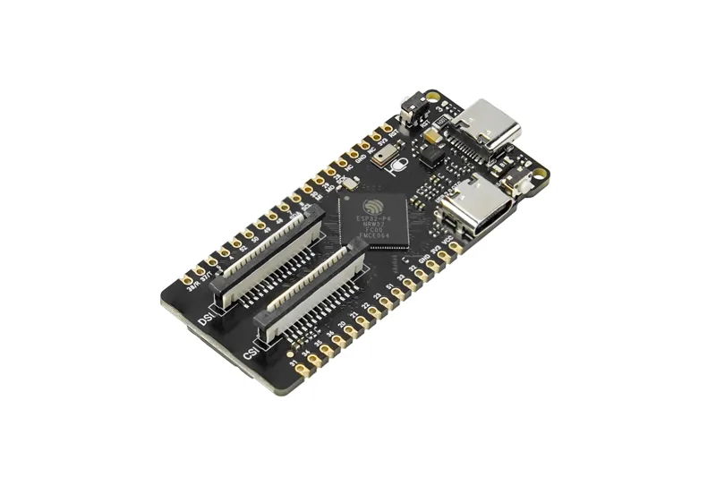</td>
</tr>
<tr>
<td valign="top">

**[DFRobot FireBeetle 2 ESP32-P4](https://www.dfrobot.com/product-2915.html)**

The smallest board that can do the whole job: 60 x 25 mm, 32 MB PSRAM, 16 MB
flash, an ESP32-C6 for WiFi and a 15-pin Raspberry Pi camera connector, so a C790
ribbon plugs straight in. No wired network - WiFi is the only link, as on the
ESP32-P4-WIFI6. Confirmed by [@Diego-fe](https://github.com/Diego-fe) in #63:
capture, USB and Wi-Fi work, about 9 fps of 1080p MJPEG over Wi-Fi from 0.56.2 on.
Build overlay: `boards/firebeetle2_p4.defaults`. The AI Kit (DFR1237) is the
same board with accessories in the box.

Two USB-C ports, and it matters which: the one beside the RST button is the P4's
USB-serial-JTAG (power, flashing and the log), the other is the USB 2.0 OTG-HS
that goes to the target. Its 5 V ties to the board's rail, so unplugging it at
the target's end reboots the KVM.

</td>
</tr>
</table>

### Boards built from a schematic, never run

:warning: **Nobody has run this firmware on any of these.** Their pins were read
off the vendor's schematic or published pin table, the images build and CI
publishes them, and that is the whole claim. Flashing one cannot damage it: the
worst case is an image that does not start, and a reflash undoes that. If you
have one, please say how it went - that is what moves a board into the list
above.

<table>
<tr>
<td width="50%">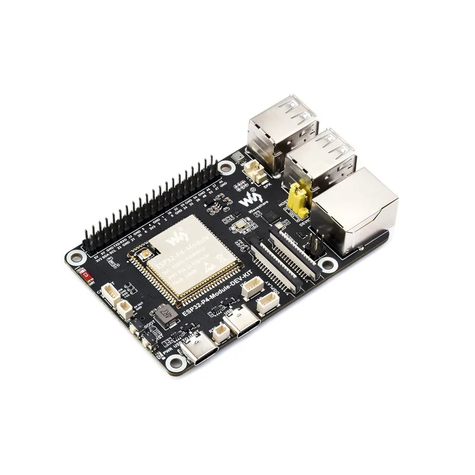</td>
<td width="50%">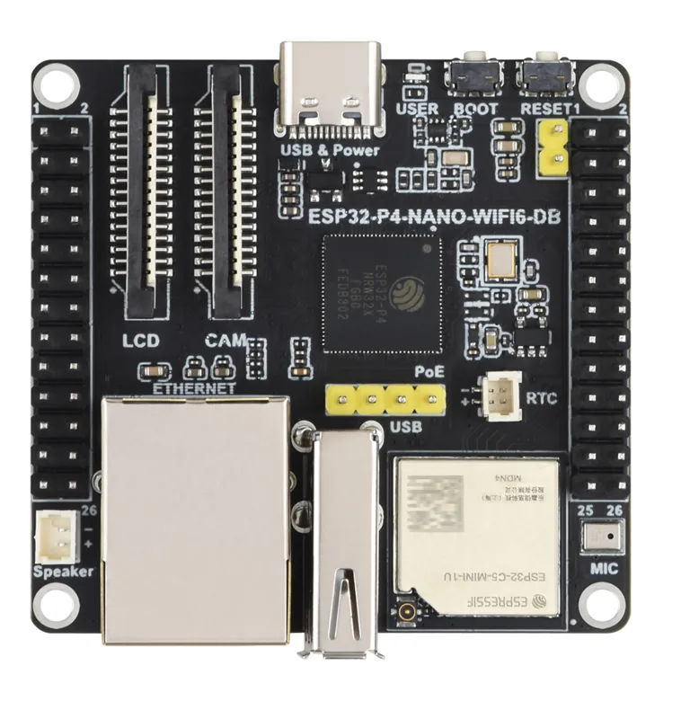</td>
</tr>
<tr>
<td valign="top">

**[Waveshare ESP32-P4-Module-DEV-KIT](https://www.waveshare.com/esp32-p4-module-dev-kit.htm)**

The WIFI6-DEV-KIT on a module: the P4, an ESP32-C6 and 16 MB of flash under one
shield, 32 MB PSRAM, on a carrier with Ethernet, a card slot, a 2x20 header and
four USB-A sockets. Every pin the KVM touches is one already in use, and the CSI
connector is the 15-pin Raspberry Pi one, so a C790 ribbon fits. Build overlay:
`boards/moduledevkit_p4.defaults`, or `boards/moduledevkit_p4_rev3.defaults` -
Waveshare's shop now lists the module with a rev 3.x chip. The -A / -B / -C kits are the same board with
a different screen in the box.

Its OTG-HS is switched **by a jumper** between one Type-A socket and an internal
hub - the KVM wants the socket - and that socket drives its own 5 V, so the lead
to the target must be an A-to-A cable with the 5 V wire cut.

</td>
<td valign="top">

**[Waveshare ESP32-P4-NANO-WIFI6-DB](https://www.waveshare.com/esp32-p4-nano-wifi6-db.htm)**

The NANO with a dual-band **ESP32-C5** in place of the C6, so it can join a 5 GHz
network - the first supported board that can. 32 MB PSRAM, 16 MB flash, 100M
Ethernet with a PoE header, a Type-A port for the target, and the 15-pin
Raspberry Pi camera connector. Build overlay: `boards/nano_wifi6_db_p4.defaults`.

It carries an ESP32-P4NRW32**X**, which is rev 3.x silicon, so unlike every other
board here it has **one image and no pre-3.0 twin**. Its right-hand header also
brings out the high-speed USB pair, so the target can be wired there instead of
the Type-A socket. That socket always carries 5 V, as on the NANO, so the lead to
the target is an A-to-A cable with the 5 V wire cut.

</td>
</tr>
</table>

<table>
<tr>
<td width="50%"></td>
<td width="50%"></td>
</tr>
<tr>
<td valign="top">

**[Espressif ESP32-P4X-C5-Function-EV-Board](https://docs.espressif.com/projects/esp-dev-kits/en/latest/esp32p4/esp32-p4x-c5-function-ev-board/user_guide.html)**

The Function EV with a dual-band **ESP32-C5** in place of the C6, and a rev 3.x
chip: Ethernet, microSD, the same 40-pin header and camera connector, 16 MB
flash, 32 MB PSRAM. The C5 sits on the pins the C6 used, which is what
esp-hosted's preset for this board says, so the build is the Function EV's with
the co-processor swapped: `boards/funcev_p4.defaults` +
`boards/funcev_c5_p4.defaults`. The HS OTG goes to a Type-C and a Type-A that
cannot be used at once - the target goes on the Type-C.

</td>
<td valign="top">

**[Waveshare ESP32-P4-WIFI6-DB](https://www.waveshare.com/esp32-p4-wifi6-db.htm)**

The ESP32-P4-WIFI6 with a dual-band **ESP32-C5** instead of the C6: an
ESP32-P4NRW32X (rev 3.x only), 32 MB flash, microSD, the HS OTG on a 4-pin
header, and no Ethernet. Waveshare's pin table matches the WIFI6 apart from the
co-processor, so the build is the WIFI6's with the C5 and the revision changed:
`boards/waveshare_p4_wifi6.defaults` + `boards/waveshare_p4_wifi6_db.defaults`.
One difference to plan for: its camera connector is the 22-pin 0.5 mm (Pi 5)
kind, not the WIFI6's 15-pin, so a C790 needs a 15-to-22-pin ribbon.

</td>
</tr>
</table>

<table>
<tr>
<td width="50%">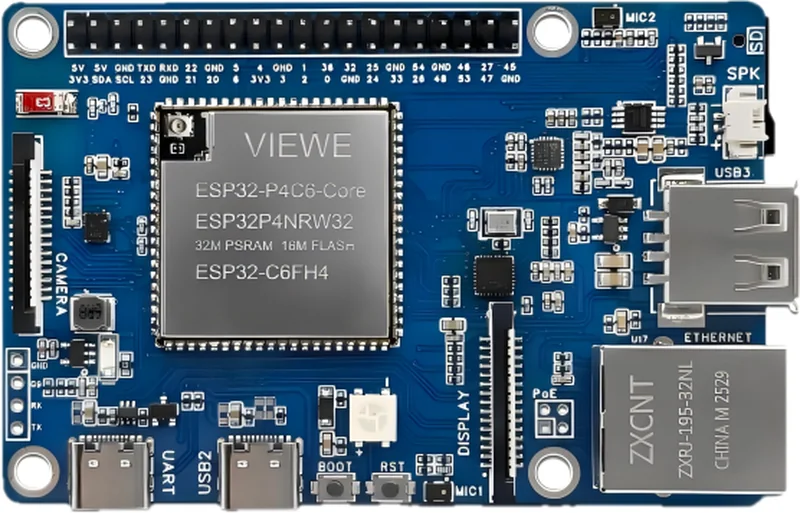</td>
</tr>
<tr>
<td valign="top">

**[VIEWE ESP32-P4-Pi](https://github.com/VIEWESMART/ESP32-P4-Pi)**

A Raspberry-Pi-shaped carrier for VIEWE's own P4 module: 32 MB PSRAM, 16 MB
flash, an ESP32-C6, IP101 Ethernet, microSD and the 15-pin camera connector, so
the C790 ribbon fits. Both schematics are published - carrier and module - so
this is the first board here where even the C6's SDIO pins were read rather than
inferred, and every one of them lands on the firmware's defaults.

Three USB ports: the Type-C marked UART is power, flashing and the log; the
other Type-C is the OTG-HS that goes to the target, so that lead is C-to-A; the
Type-A socket is a host port the KVM does not use. PoE is only half wired - the
magjack's centre taps reach a 4-pin header, but the module's 5 V has to go back
in through the expansion header. Build overlay: `boards/viewe_p4_pi.defaults`.

</td>
</tr>
</table>

<table>
<tr>
<td width="50%">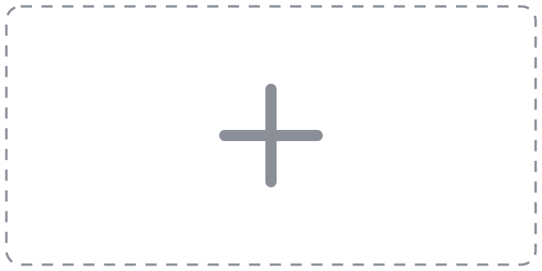</td>
</tr>
<tr>
<td valign="top">

**Your board is not here?**
[Open an issue](https://github.com/espkvm/espkvm/issues/new) with a link to its
schematic. If it clears the five points under
[What rules a board out](#the-device--pick-one-esp32-p4-board), adding it is an
overlay and a build - the pins live in [menuconfig](docs/PORTING.md), not in the
code - and it can land in the next release. That is how most of the targets here
arrived. If it does not clear them, the answer says which point it fails on,
which is worth having before the board does.

</td>
</tr>
</table>

### Companion boards

The capture board is what turns the target's HDMI into something the ESP32-P4 can
read. Either of the two below does it; both carry the same TC358743 bridge. There
is a third, further down, that fits one board only.

<table>
<tr>
<td width="50%">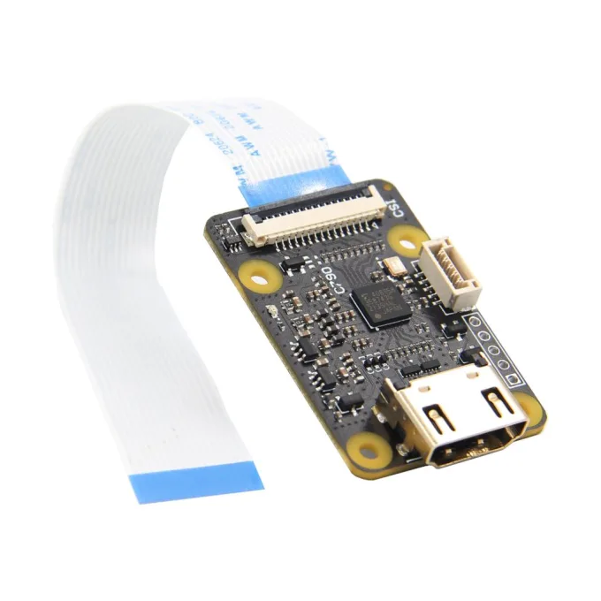</td>
<td width="50%"></td>
</tr>
<tr>
<td valign="top">

**[Geekworm C790](https://wiki.geekworm.com/C790)** (required, or the one beside it)

A TC358743 HDMI -> MIPI CSI-2 bridge that turns the target's HDMI output into a
camera stream the ESP32-P4 can read. Any other TC358743 capture board should do
just as well: the firmware talks to that chip, not to the board around it.

It also brings the bridge's I2S audio out on a 5-pin connector of its own, and
Geekworm puts a cable for it in the box. Nothing reads it yet; the pinout and
what wiring it would take are in
[docs/HARDWARE-NOTES.md](docs/HARDWARE-NOTES.md).

The [Geekworm C792](https://wiki.geekworm.com/C792) is the same TC358743 with a
GSV2001 splitter in front, so it should work too - **not tested here**, and
with one thing to watch. This firmware limits the input by writing an EDID into
the TC358743, because two CSI lanes carry about 81 Mpixel/s and a mode above
that gives a black frame rather than a slower one. With a splitter ahead of the
bridge the source may be reading the splitter's EDID instead, so if you see a
black screen at 1080p60, that is the first thing to suspect. Use its 15-pin
(2-lane) connector, and power it from its own 5 V input as Geekworm advises.

</td>
<td valign="top">

**[Waveshare HDMI to CSI Adapter](https://www.waveshare.com/wiki/HDMI_to_CSI_Adapter)** (19137)

The same TC358743 bridge on Waveshare's board, so the firmware treats it exactly
like the C790. A full-size HDMI input, a 15-pin Raspberry Pi camera connector
that also powers it, and the bridge's I2S audio on the pin header. It has only
the 15-pin connector, so on a board with the 22-pin one - the P4-ETH - it needs
a 15-to-22-pin ribbon, the kind sold as a Raspberry Pi 5 camera cable.

Confirmed by [@deltorek112](https://github.com/deltorek112) on the
ESP32-P4-WIFI6-POE-ETH: 1080p over H.264 at 23 fps
([issue #51](https://github.com/espkvm/espkvm/issues/51)).

</td>
</tr>
</table>

<table>
<tr>
<td width="50%"></td>
</tr>
<tr>
<td valign="top">

**[M5Stack Add-on Display In](https://shop.m5stack.com/products/add-on-display-in-for-poe-p4-lt6911d)**
(for the Unit PoE-P4 and PoE-P4X only)

The odd one out, and the only capture board here that is not a TC358743: it
carries a **Lontium LT6911D**, and it brings a microSD slot with it. Note the
ribbon in the picture - 24-pin, and it plugs onto M5Stack's own units and onto
nothing else. It is not the 15-pin Raspberry Pi camera cable every other board
on this page uses, so it will not fit them, and they will not drive it.

Checked on hardware: at 1280&times;720 about 22 fps over MJPEG and 17 over H.264
(9 and 6 at 1080p), and the card slot reads and writes at 40 MHz.

</td>
</tr>
</table>

<table>
<tr>
<td width="50%">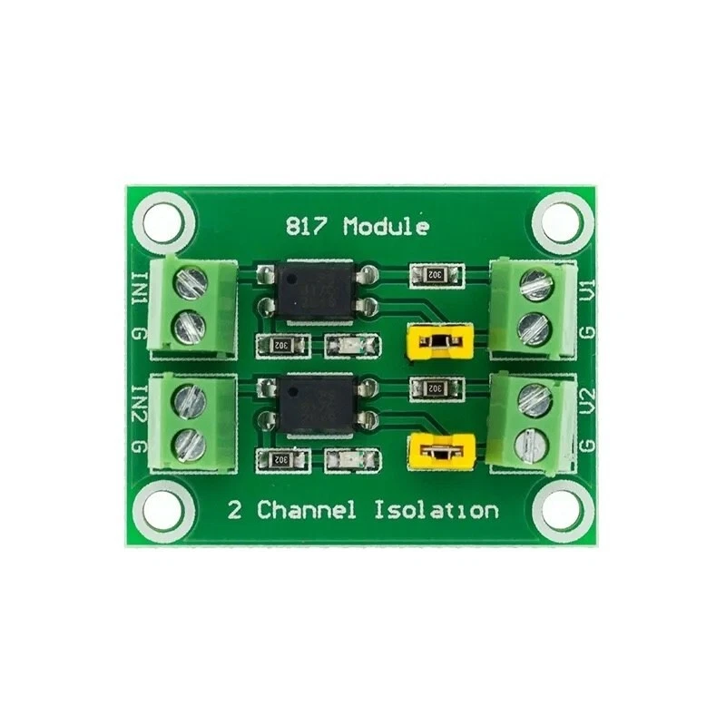</td>
<td valign="top">

**ATX power control — an optocoupler module** (optional)

A small board that presses the target's power and reset buttons and senses the
power LED without a direct electrical connection. A relay board does the two
buttons just as well, but cannot sense the LED. Wiring for both is in
[docs/wiring.md](docs/wiring.md).

The **M5Stack Unit Relay** is one such relay, on a Grove cable: its yellow wire
is the "Power button GPIO" in Settings &rarr; Power, with "Buttons active-high"
on, and its contacts go across the target's power switch pins. One relay is one
button - a second unit does reset. On the M5Stack Unit PoE-P4 the Grove port is
GPIO 53 (yellow) and 54, the same pins as the status display, so it is one or
the other. Not tried with the unit yet.

**A button on the box.** Settings &rarr; Power &rarr; Button on the box puts a
push button on a free pin - the M5Stack Unit Button on a Grove port, or any
switch to ground - and gives a short press and a 1.5 s hold an action each:
the target's power button, a hard off, reset, Wake-on-LAN, a runbook, saving
the dashcam's last seconds, or a screenshot. The same actions a schedule can
run. Not tried with real hardware yet.

</td>
</tr>
</table>

**Status display — a small OLED or round LCD** (optional)

<table>
<tr>
<td width="33%">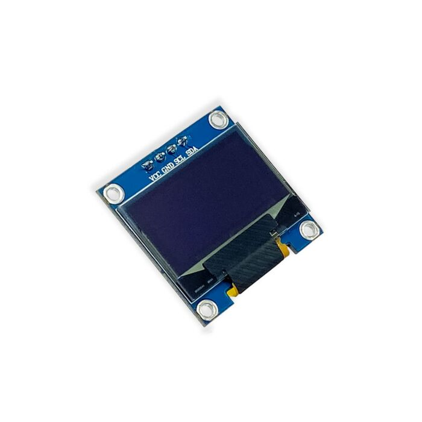</td>
<td width="33%"></td>
<td width="33%">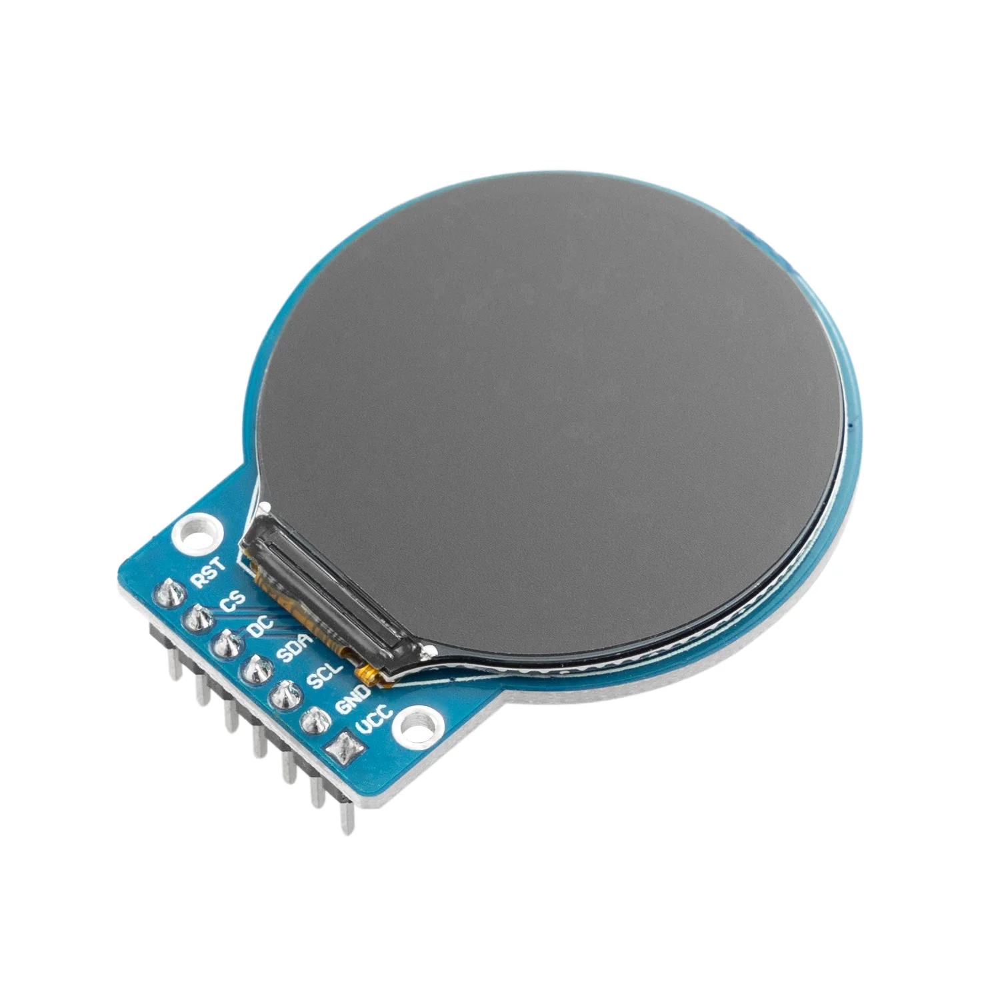</td>
</tr>
<tr>
<td valign="top">

**I2C OLED (SSD1306 / SH1106 / SSD1315 / SH1107 / SSD1309)**

A mono OLED on four wires (VCC, GND, SCL, SDA). It shares the capture chip's I2C
bus and needs no pins of its own. SSD1306 works as 128&times;64, 128&times;32,
96&times;16, 72&times;40, 64&times;48 and 64&times;32; SH1106 as 128&times;64,
128&times;32, 96&times;16 and 64&times;48; SSD1315 as 128&times;64 and 72&times;40;
SH1107 as 128&times;64, the M5Stack Unit OLED; SSD1309 as 128&times;64, the
M5Stack Unit Glass2 transparent OLED (not tried on one yet; the first Unit Glass,
with a microcontroller in front of its panel, is a different thing and not
supported).
Under Settings &rarr; Display you pick the panel by controller and size in one list, because these controllers cannot
be asked how big the glass is. The shorter the panel, the fewer status
lines it shows, and the address is the line it keeps. A line that does not fit
the width steps along a character at a time, and the screen waits until it has
been read to the end. In hotspot mode it shows the
network and its password as a QR code, alternating with the same thing as text,
so a phone can join from what is on the glass. Panels too short for a readable
code show only the text.

</td>
<td valign="top">

**M5Stack Mini OLED Unit**

A 0.42&Prime; 72&times;40 SSD1315 panel with a Grove cable. On the M5Stack Unit
PoE-P4 it plugs into the Grove port and there is nothing to solder and nothing
to set: that port is an I2C bus of its own, and the firmware for that board
already knows its pins. Any board can use an OLED on a bus of its own the same
way &mdash; name the two pins as OLED SDA and OLED SCL under Settings &rarr;
Display. Twelve characters to a line and four lines under the heading, so it
shows the address, the link, the picture's size and the health figures, one
screen at a time.

</td>
<td valign="top">

**Round colour LCD (GC9A01)**

A 1.28&Prime; 240&times;240 round SPI LCD, e.g. the Waveshare module. The cheap
1.5&Prime; GC9A01A modules work too. Wire its SPI pins to any free GPIOs and pick
them in the console. In hotspot mode it shows a QR code a phone camera can join
from.

Settings &rarr; Pins draws the board's expansion header the way it is printed,
with what holds each pin, so a free GPIO can be found where the wire actually
goes rather than in a list of numbers.

</td>
</tr>
</table>

Both are off by default &mdash; turn the display on in Settings and choose its type.
Either can be turned upside down there too: an enclosure does not always leave the
connector facing the way the picture wants it, and the switch applies at once,
without a restart.

The LCD needs five free GPIOs, and which ones are free depends on the board - so
a build offers a set that is known to work there, and you only change them if you
wired it differently. Boards that nobody has checked yet offer the Function EV
set. What is offered:

| Board | SCLK | MOSI | CS | DC | RST |
|---|---|---|---|---|---|
| ESP32-P4 Function EV | 20 | 21 | 22 | 26 | 33 |
| Waveshare ESP32-P4-NANO | 22 | 5 | 32 | 33 | 36 |

On the Function EV board, **do not use GPIO 45 for DC** &mdash; it carries SD_PWRn,
so the panel gets no clean logic level and stays dark with nothing in the log.
The NANO pins come from [@DaveDavenport](https://github.com/DaveDavenport), who
tested them.

**Cables:** a CSI ribbon between the two boards (the C790 comes with a 15-pin
and a 22-pin one; the P4-ETH takes the 22-pin), HDMI from the target,
and a cable from the board's USB 2.0 OTG-HS port to the target. Add a microSD
card if you want boot-from-image.

Which connector the OTG-HS port is depends on the board. The Function EV and
Guition put it on USB-C, and the NANO and the PoE board on a full-size USB-A. On the
Waveshare ESP32-P4-ETH it is not a USB socket at all but the **MX1.25 header**,
so that one needs an MX1.25-to-USB-A cable. The other USB-C on any of these
boards is the serial bridge, for flashing.

### A case

<table>
<tr>
<td width="50%"><a href="https://www.printables.com/model/1824874-esp32-p4-eth-kvm-case">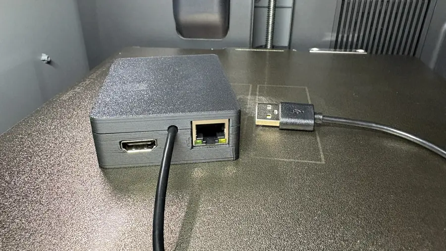</a></td>
<td valign="top">

**[ESP32-P4-ETH KVM Case](https://www.printables.com/model/1824874-esp32-p4-eth-kvm-case)** (optional)

A printed box for the Waveshare ESP32-P4-ETH and the C790 together, published by
[Colin Hickey](https://github.com/chickey). It keeps the two boards and the OTG
cable to the target tidy; HDMI, Ethernet and that cable all come out of one
side. The P4 board is held tightly, so take care when you take it out again.
The author is asking for feedback on the fit.

</td>
</tr>
</table>

<table>
<tr>
<td width="50%"><a href="https://makerworld.com/en/models/3238485-kvm-case-for-esp32-p4-eth-and-c790">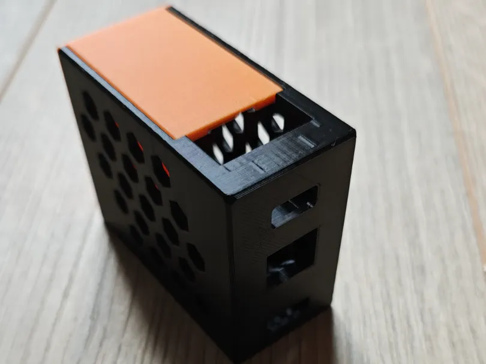</a></td>
<td valign="top">

**[KVM case for ESP32-P4-ETH and C790](https://makerworld.com/en/models/3238485-kvm-case-for-esp32-p4-eth-and-c790)** (optional)

A second box for the same pair of boards, adapted for this project by
[Fabrion365](https://makerworld.com/en/@Fabrion365) after a user asked. Vented
along one side, with the ports coming out of the ends.

</td>
</tr>
</table>

<table>
<tr>
<td width="50%"><a href="https://makerworld.com/de/models/3317162-esp32-p4-nano-c6-kvm-case"></a></td>
<td valign="top">

**[ESP32-P4-NANO / C6 KVM case](https://makerworld.com/de/models/3317162-esp32-p4-nano-c6-kvm-case)** (optional)

A compact box for the Waveshare ESP32-P4-NANO with its ESP32-C6 and the C790,
designed by [Crisspii](https://github.com/Crisspii), who also sent the NANO fix
in 0.48.0. Ethernet, USB and HDMI come out of one end, the sides are vented, and
there is room for a 10 &times; 10 &times; 7 mm heatsink. It closes with five M2
&times; 8 mm pointed screws; the assembly notes are with the model. The same
model has a version with a status OLED that fits the plain case's top, so a
printed case can be upgraded, and there is a
[10-inch rack mount](https://makerworld.com/de/models/3354879-esp32-p4-nano-kvm-10-inch-rack-mount)
for one or two of them.

</td>
</tr>
</table>

<sub>Board and module photos (c) their makers, taken from product pages and used
only to identify the hardware. The case photos are by their authors:
[Colin Hickey](https://github.com/chickey), CC BY-NC,
[Fabrion365](https://makerworld.com/en/@Fabrion365) and
[Crisspii](https://github.com/Crisspii). ESP-KVM is not affiliated with
[Espressif](https://github.com/espressif), [Waveshare](https://github.com/waveshareteam),
[Geekworm](https://github.com/geekworm-com), [Guition](https://github.com/guitionofficial)
or [M5Stack](https://github.com/m5stack).
The pin map is in `components/kvm_board/include/kvm_board.h`.</sub>

## Quick start

Download your board's `espkvm-<version>-<board>-merged.bin` (for example
`-p4-eth-` for the Waveshare ESP32-P4-ETH, `-funcev-` for the Function EV) from the
[releases](https://github.com/espkvm/espkvm/releases) and write it at offset 0
with [esptool](https://github.com/espressif/esptool) - one file, no unpacking:

```sh
esptool --chip esp32p4 -b 921600 write-flash 0x0 espkvm-<version>-<board>-merged.bin
```

Or flash straight from the browser - Chrome or Edge, nothing to install - at
[espkvm.io/flash](https://espkvm.io/flash/). Full step-by-step instructions,
including the serial-port and driver notes for Linux, macOS and Windows, are in
[docs/FLASHING.md](docs/FLASHING.md).

Then connect Ethernet, HDMI from the target, and the board's USB 2.0 OTG-HS port
to the target (see **Cables** above - on the Waveshare ESP32-P4-ETH that port is
the MX1.25 header, not the USB-C socket). The device announces itself over mDNS:
open **https://espkvm.local/**.

The device is its own certificate authority. It makes a CA on first boot and
signs its own certificate with it, so the browser warns you the first time.
Clicking through that warning is enough to sign in and watch the MJPEG stream.

H.264, the keyboard and the mouse need more: a real *secure context*, which a
self-signed certificate does not give until it is trusted. Without it the browser
runs neither the WebSocket channel nor the H.264 decoder.

To clear the warning for good, trust the device's CA once. Download it from
**Settings -> Security -> Download CA certificate**, or from
`http://espkvm.local/cert.pem` - that one is served in the clear, so you can
fetch it before trusting anything. Import it into your operating system or
browser as a **trusted authority**, not under "your certificates". Then reach the
device by name, at **https://espkvm.local**.

On a static IP the certificate names the address as well, so `https://<ip>` works
once the CA is in. On DHCP, use the name.

The device is dual-stack. On a network that advertises IPv6 it takes an address
there too, with nothing to configure, and `espkvm.local` resolves to it. From the
next restart the certificate names those addresses, so `https://[address]/` is
trusted like the v4 one. There is a switch in **Settings -> Network -> IPv6**.

Tapping the **network icon** in the console footer shows the whole picture: what
the device is connected by, the name it answers to, its IPv4 address, every IPv6
address with what each is good for, and the MAC for a DHCP reservation. Each one
is a link and has a Copy button.

A network with no IPv4 at all works too. The one thing that cannot follow is
Wake-on-LAN - the magic packet is an IPv4 broadcast, and IPv6 has none - so the
console says it is unavailable instead of pretending. The WireGuard and Tailscale
tunnels still need a peer reachable over IPv4.

Sign in as **admin / admin**. The console will not go any further until that
password is changed: a KVM left on the password it shipped with is a keyboard
on someone else's machine, offered to whoever finds it.

If there is no cable at hand and the board carries a WiFi co-processor, a new
device puts out a hotspot of its own instead. It waits twenty seconds for the
network port, and if nothing turns up it opens **ESP-KVM-xxxx** with no
password - join it and the console is at `http://192.168.4.1/`. A board with no
network port at all (the ESP32-P4-WIFI6, the FireBeetle 2) opens it straight
away. It is open
because the password it would otherwise invent is printed to a serial console
and a display, and some of these boards have neither. Nothing is handed over
with it: until a real password is set, the only thing that answers is the page
that sets one. There is a switch in **Settings -> Network** to turn it off.

Setting the password closes the open hotspot, so the same form asks where the
device goes next: the network cable (on boards that have one), your WiFi, or
its own hotspot with a password you choose. The device then restarts into it.

After that the cable is only needed if something goes badly wrong - updates are
installed from the console itself. Checking for them is **off by default**:
turn on **Settings -> System -> Updates -> Offer firmware updates**, and the
console tells you when a newer build is out and installs it in one click. Your
browser asks, not the device, so the device still never reaches the internet.

## If it does not work

Five things account for most of it, and each has a way to tell it apart from
the others without a multimeter.

**The target never sees a keyboard or a mouse.** Check which connector the cable
is in. On the Waveshare ESP32-P4-ETH the USB-C socket is only the serial bridge,
for flashing and the log. The port that presents the keyboard and mouse is the
small 4-pin **MX1.25 header** next to it, marked `USB` on the silkscreen. No
cable from that USB-C will ever reach the target. The other boards put the same
port on USB-C or USB-A - see **Cables** above.

To check it from the device instead of by eye, open
`https://espkvm.local/api/v1/system/usbprobe`. An empty trace means the target
has never seen the KVM at all, which is exactly what a cable in the serial port
looks like.

**The keyboard does not work, or the picture never starts and the console keeps
reconnecting.** Both are the same cause, seen from two sides: the keyboard, the
mouse and H.264 all ride a WebSocket, and a browser only opens one on a page it
considers secure - which a self-signed certificate is not, until it is trusted.
MJPEG and signing in work anyway, which is why the rest looks fine.

One step tells it apart from a capture fault: set **Settings -> Video -> Stream
codec** to `mjpeg`, which is plain HTTP. If the picture appears, it is the
certificate. Install the device's CA and reach it by name - Quick start says how.

**No signal, or the target only shows its screen after it has booted.** The KVM
holds HDMI hotplug low until it has loaded its EDID and started capture, and that
takes a good ten seconds from power on. A machine that looks for a monitor during
its own POST, and finds none, may decide it has no external screen and never turn
the output on. So power the KVM first, or replug HDMI once the KVM is up. If the
picture arrives but the source refuses a mode, try a capped **EDID profile** in
Settings -> Video.

While a source is powered and sending nothing, the device offers it a fresh
hotplug by itself - ten seconds in, then twenty, then forty. That is all one end
of a cable can do, and some machines never look at the connection again once
they have started: an Orange Pi 4 Pro reported here would not come back after a
re-plug into this device, and would not come back for a television either.
The fix for that one is on the machine, and somebody has written it up - a udev
rule that re-applies the mode when the connector changes state:
[check456-beep/orangepi-hdmi-fix](https://github.com/check456-beep/orangepi-hdmi-fix).

**A pin you picked in Settings does nothing.** It may not be a pin at all. The P4
has 55 GPIOs and a board brings out maybe half. **Settings -> Pins** draws the
board's expansion header the way it is printed, with what holds each pin, so you
can find a free one where the wire actually goes. Some pins are also taken by
hardware the firmware never touches: on the Function EV, GPIO 45 carries the
microSD power net whether we use it or not.

**It rebooted on its own.** The log line at the top of every boot says how the
last run ended - a panic, a watchdog, a brownout or a plain reset are four
different bugs. If it was a panic, the firmware also wrote a **crash dump** to
flash before rebooting: registers and task stacks as they were. **Diagnostics ->
Download the crash dump** hands it over as a file, and attaching it to an issue
turns "it rebooted overnight" into a backtrace. It carries no settings and no
keys. A device that was updated over the network keeps the partition table it
was first flashed with, so the dump needs one cable flash of the table to work;
without it the device simply never has one.

Flashing problems - the port not appearing, drivers, permissions - are in
[docs/FLASHING.md](docs/FLASHING.md). Anything else: the device keeps its own log
across a restart, and **Diagnostics -> Download the log** is the fastest way to
show what happened.

**Still stuck?** Ask in [Discussions](https://github.com/orgs/espkvm/discussions) -
say which board, which capture board and what the target is, and attach the log
from Diagnostics in the console (the button with the chip temperature). If it is
clearly a bug, [open an issue](https://github.com/espkvm/espkvm/issues/new) instead.

## Building from source

The web console lives in a submodule ([espkvm/console](https://github.com/espkvm/console)),
so clone with `--recursive` (or run `git submodule update --init` in an existing
clone). Without git, take `espkvm-<version>-source.tar.gz` from a release (from
0.56.3 on): GitHub's own "Source code" archives leave the submodules out.

```sh
git clone --recursive https://github.com/espkvm/espkvm
tools/install-idf.sh                          # ESP-IDF 6.1, once
. tools/env.sh
cd web && npm ci && npm run build && cd ..    # the console is embedded in the firmware
idf.py build
idf.py -p /dev/ttyACM0 -b 921600 flash
```

There is no `menuconfig` step for the default board: everything it needs is in
`sdkconfig.defaults`. To build for another board, apply its overlay - see
[boards/](boards/README.md).

The console can also be developed against a simulated device, with no hardware
attached at all:

```sh
cd web && npm run dev:mock
```

### Tests

Everything that can be checked without a device runs in a couple of seconds:

```sh
tools/test.sh          # all of it
tools/test.sh host     # just the C
tools/test.sh web      # just the console
```

That is the C that reads a screen as characters and the C that decides a screen
has gone to one flat colour - both plain arithmetic over a pixel buffer, so they
compile and run on a development machine - plus the console's own logic (the
demo's machine, the settings file, the keyboard tables, the text layer) run by
`node --test`, and the paste tables checked against the real keyboard layouts.
The same suites run in CI on every push. Building the firmware itself needs
ESP-IDF and takes minutes, so it is not part of this.

## How it works


**Video.** The bridge is polled for signal state and timings, so a target
switching from an 800x600 firmware screen to a 1080p desktop is followed
without intervention. Encoding is done by hardware - the JPEG engine, or the
H.264 encoder with the PPA converting colour on the way in.

Measured at 1080p, on both silicon revisions:

| | MJPEG | H.264 |
|---|---|---|
| Frame rate, Waveshare ESP32-P4-ETH (rev v1.3) | 20 fps | ~7 fps |
| Frame rate, Function EV (rev v3.2) | 23 fps | 22-24 fps |
| Idle screen | 0 kbit/s (unchanged frames are dropped) | 170 kbit/s |
| Screen in motion | 8.5 Mbit/s | ~500 kbit/s |
| Chip temperature at full load | 46 &deg;C (rev v1.3) | 34 &deg;C (rev v3.2) |

Browsers decode H.264 through WebCodecs, and they only offer it on a secure page.
Over plain HTTP no browser can play it, however new - the console says so when it
cannot.

**The gap between those two rows is the silicon.** Below revision 3.0 the CSI
receiver cannot produce YUV420, and the H.264 encoder will not take RGB. So every
frame detours through the pixel accelerator to change colour space, and that
detour costs ~104 ms of the ~150 ms a 1080p frame takes.

On revision 3.x there is no detour: capture hands the encoder YUV422 and it takes
it as it is. H.264 went from ~7 to 22-24 fps at 1080p, and 28 at 720p - as fast
as MJPEG, at a fraction of the bandwidth, and cooler. On the older silicon the
conversion and the encode at least overlap now instead of running one after the
other. The measurements are in
[docs/HARDWARE-NOTES.md](docs/HARDWARE-NOTES.md).

**Input.** One composite USB HID device with four parts. A boot-protocol
keyboard, which firmware screens understand. An absolute pointer, so a click
lands where it was aimed whatever the target's mouse acceleration is doing. A
relative pointer, for software that captures the cursor. And the consumer keys.
An old BIOS that does not find the keyboard inside that bundle can be given a
keyboard alone, at USB 1.1 speed: Settings &rarr; Input &rarr; Old BIOS keyboard.
Everything is released when the browser goes away, so a dropped connection cannot
leave a key held down on the target.

One thing to know about the absolute pointer: it addresses the target's whole
desktop, not the single output being captured. On a target with a second display
the desktop is wider than the picture, so the pointer travels further than the
mouse and part of the picture aims at the screen you cannot see. Unplug the second
display while working through ESP-KVM, or switch the pointer to relative in
Settings - relative sends movement rather than position, so the desktop's layout
stops mattering.

**Target OS.** How a machine enumerates a USB device is a fingerprint. Windows
asks for a Microsoft OS descriptor, macOS reads each string twice, Linux does
neither. So the console guesses whether the target is Windows, macOS, Linux or
Android, and shows it next to the USB status, with the raw trace behind a click.

The guess decides which key combinations the console offers - magic SysRq on
Linux, Task Manager on Windows - and whether the Meta key is labelled Win, Cmd or
Super. A `Target OS` setting overrides it when the guess is wrong, or when the
target never showed enough to tell. If it reads your machine wrong, send that
trace and a later build can learn it.

**Every feature is optional.** Each one reports whether it is compiled in,
whether the hardware supports it, and whether it is switched on. A control the
hardware cannot support is shown disabled, with the device's own explanation on
it - not hidden, and not left to fail silently. `GET /api/capabilities` is that
registry.

**Recording and screenshots.** The record button under the picture writes the
screen to the microSD card, into VIDEO/, as H.264 in .ts files. It records the
same stream the viewers get, so it costs no second encode: on the Function EV the
picture stays at 21-22 fps with a video playing on the target, and no frame is
lost. A .ts plays in VLC and most players, and a file cut off by a pulled card or
a power cut plays up to the last few seconds. Files over 3.9 GB continue in a
second file, on FAT32 and exFAT alike: the device keeps every file under 4 GB. The camera button saves a JPEG into
SCREENSHOTS/, on either codec. Both are listed in their own panel, where they can
be downloaded and deleted. Recording needs H.264 and a card the device can write,
and not the whole card handed to the target.

A recording is split into files of 10 minutes and stops after an hour; both are
settings. A runbook can start and stop one (`record 300`, `record stop`,
`screenshot`), and so can Home Assistant. With keystrokes in recordings switched
on, each video also gets a .srt of what was pressed and clicked - shortcuts and
named keys, and typed text either as dots or, if you choose, in full. Put the
.srt next to the video and VLC or mpv shows it.

Play in the recordings panel streams a recording from the card, with seeking and
the subtitles shown on the picture; `captures/file` answers HTTP ranges.

**Searching a recording.** With the screen's text saved (Settings, Video), the
recordings panel finds a phrase that was on the target's screen and plays from
that moment. It works on screens a character generator drew - a BIOS, an
installer, a console - not on a desktop.

**Timelapse.** One frame every few seconds or minutes, played back at 25 fps, so
a night of a long install fits in a minute. Start it from the recordings panel, a
runbook (`timelapse 60`) or `POST /api/v1/record/start?every=60`. It keeps the
stream's keyframes (about one every two seconds), runs until stopped, and becomes
an MP4 when it ends.

**Dashcam.** With the dashcam on, the device keeps the last stretch of the screen
in memory (up to 5 MB: minutes of a quiet screen, about 40 seconds of a playing
video) and saves it to VIDEO/ when something happens: the screen goes one flat
colour for half a minute, a screen alert phrase appears, or the power LED goes
off. It keeps recording 30 seconds after. The clip becomes an MP4 with a chapter
for each event, so it plays in a browser, and with Telegram set up it arrives in
the chat as a video. A button under the picture, `POST /api/v1/record/event` and
a Home Assistant button save one by hand.

The past can also be kept on the microSD card instead of memory: the device then
writes the screen to VIDEO/.dashcam in 15-second pieces all the time and deletes
the old ones. That works on boards with little PSRAM, like the P4-ETH, and
reaches back as far as the setting says. The card cannot be handed to the target
while it runs. A black screen does not start a clip; a coloured one, like a stop
screen, does.

**Virtual media.** A disk image is presented to the target as a USB drive it can
boot from - a rescue system, an installer, a live image. The console lists what
is there and lets you pick which one the target sees. Images live in two places.

A **microSD card** holds the large ones. FAT32 and exFAT both work, and so do
MBR and GPT, so a card as it comes out of the packet is usually fine: above
32 GB that means exFAT on a GPT card, which older firmware could not read at
all. On exFAT an image can be over 4 GB, like a full DVD installer; the console
sends such a file in 2 GB parts. Recordings stay under 4 GB a file on either.
The console uploads images to the card and deletes them - but check the card
can be written at all before relying on it. A 256 GB SDXC card here mounted,
read and served images perfectly and refused every single write (a CRC error
with the controller reporting a transmit FIFO underrun), while a 32 GB card on
the same board and firmware wrote normally. One card of each, so not a law -
but Flipper Zero tell their users the same thing for their own SD slot: pick a
well-tested card from a known maker rather than the fastest or largest one. So
if you mean to upload to the card, a small branded SDHC card - 16 to 32 GB is
more space than this needs - is the safer buy.

By default a `.iso` goes to the target as an optical drive, any other image as a USB
disk. The drive answers the commands a real one does - the table of contents,
the drive profile, "a disc was inserted" - which Windows, macOS and some
firmware ask before they read. An image above 900 MB shows up as a DVD, a
smaller one as a CD. Checked with a Linux target so far.

How fast the card runs depends on the board, so the device finds it per card.
It starts at the fastest clock the board allows and steps down (40, 20, 10, 4,
2 MHz) when the card fails to mount, fails a test read, or fails a transfer
later. While the card is idle it tries one step up again. The Media panel shows
the speed it settled at, and Settings > Storage > microSD speed caps it by hand.

The card can be swapped while the device runs. The slot is checked every five
seconds, so a card pulled out disappears from the target within about that, and
one pushed in mounts and is offered again without a restart. Pulling a card the
target is reading is safe in the sense that the device notices and drops the
drive; whatever was reading it will report an error, as it would with any USB
drive yanked mid-read. On a board using WiFi, the ESP32-C6 holds the other slot
of the same SD host, so there a card put in after boot is picked up only on the
next restart - a card taken out is still noticed.

Every supported board with a microSD slot powers the slot's pins from one of
the chip's LDOs, LDO 4 (`CONFIG_KVM_SD_IO_LDO_CHAN`) - read off each vendor's
schematic. Until it was switched on, the card only read at 4 MHz, and on a
rev 1.3 chip it did not write at all. The boards below are the ones checked on
hardware.

| Board | Bus | Card read | Card write | Upload from the console (Ethernet) |
|---|---|---|---|---|
| Function EV (rev 3.2) | 40 MHz | ~8.5 MB/s | ~4 MB/s | ~3.5 MB/s |
| P4-ETH (rev 1.3) | 40 MHz | ~9 MB/s | ~4 MB/s | ~1.5 MB/s |

The target reads the virtual drive over USB at ~9 MB/s when the whole card is
handed over (both boards) and ~7.5 MB/s from an image file (Function EV).

The upload is slower than the card because TLS runs on the chip, and the rev 1.3
chip is the slower one. **Pause the video while you upload.** The encoder and the
Ethernet chip share a bus, and at full frame rate the upload drops to a tenth.
So the video goes down to 2 frames a second by itself for the length of an
upload, which still costs about half; the pause button next to the upload gives
the full speed back.

The other boards with a slot start at 40 MHz as well and write on both chip
revisions, but nobody has run them on hardware yet - if the card steps down on
yours, the Media panel says so, and a report helps.

The M5Stack Unit PoE-P4 has no slot of its own: the card is on its Add-on Display
In, on other pins and fed from the add-on rather than from the chip's LDO. That
was why writes were refused there at first - "may write" was tied to that LDO -
and the two are separate settings now. Checked on hardware: 40 MHz, no bus
errors, and it writes.

The **device's own flash** holds one small image, in a 4 MB partition: enough for
iPXE, memtest or a DOS floppy, with no card at all. Flash writes work on every
board, so that one uploads from the browser, or over the cable with
`tools/fetch-rescue.sh` (netboot.xyz by default). It ships empty, and taking the
partition table that carries it is a one-time full flash - the browser flasher
does it - after which the image updates over the network.

The device can also **download an image itself** from a link: netboot.xyz into
the flash slot with one click in the Media panel, or any http/https URL onto the
card. The file does not pass through the browser, so a phone works, and a NAS
link works too. Over HTTPS it asks for ChaCha20 first: the hardware AES needs
internal RAM on every record, and with video running a download died part-way.

**Reading the screen.** When the target is in a character mode - a BIOS setup, a
UEFI boot menu, memtest, a Linux console - the device reads the screen back as
text. The console lets you select it with the mouse, or copy the whole screen.

This is not OCR. A text screen is drawn by a character generator, so each cell is
looked up in the font's own shapes. It either matches exactly, or it comes back
as `�`. Never a guess, never a quiet blank, and no "recognised with errors" to
act on by mistake.

Three fonts are known: the 8x16 a legacy BIOS draws with, the slightly different
8x16 a Linux console draws with, and the 8x19 a UEFI console draws with. So a
720x400 setup screen, a 1024x768 boot menu and a Linux console all read. It costs
one pass over the frame, only in character modes, and only once the picture has
stopped moving. A firmware that paints its setup as a picture has no grid, and is
left alone.

The reading can also be left running with nobody connected. Give the device a
phrase to watch for and it keeps looking with the console closed - which is the
state a KVM is bought for, because the machine that falls over does it at three
in the morning. The alert is raised when the phrase appears and cleared when it
goes. Both edges reach the log, and Home Assistant if MQTT is on.

A runbook takes that one step further: a script of keys to send and phrases to
wait for, run on the device itself. `wait Press F2 to enter setup`, `key f2`,
`wait Boot`, `type` a password - a macro with patience, for the BIOS work that
used to need somebody watching the screen. It fails at the line whose phrase
never turned up, and it stops when told to. Like the reading it is built on, a
wait only sees a text screen. The language, the key names and the limits are
in [docs/SCRIPTS.md](docs/SCRIPTS.md).

**Security.** The device serves HTTPS with a certificate it issues itself on
first boot, and asks for a password before it will do anything. The password is
stored as a salted PBKDF2 hash, sessions are HttpOnly cookies held in memory -
so a reboot signs everyone out - and repeated failures pay a growing delay.

Two-factor sign-in is one switch away, in Settings -> Security: after the
password, a six-digit code from an authenticator app (Google Authenticator,
Aegis, 1Password and the like), set up by scanning a QR code the device draws.
Eight one-time recovery codes come with it, for a lost phone. The code depends
on the time, and a device with no internet has no clock after a restart, so
then it is checked against the browser's own clock - and each code works only
once, even across a restart. A script that signs in with the password stops
working when this is on: give it a shared session cookie instead (see
[Driving it from an AI agent](#driving-it-from-an-ai-agent)).

A forgotten password - or a lost phone with no recovery codes - is cleared with
the board button, two-factor sign-in included. Reset the board, then
press and hold the button for two seconds, while the panel or the log asks you
to. Hold it *after* the reset, not through it: on boards where that button is
also the ROM's download strap, holding it through a reset drops the chip into
firmware-download mode instead.

Physical presence is the credential here, because whoever can hold that button
can also unplug the machine this device is attached to. The same gesture puts the
network back somewhere reachable - DHCP, the wired link, no operator certificate
- because a WiFi network that has vanished locks a device away just as a
forgotten password does.

**Heat.** The chip is watched, and if it ever gets hot the frame rate is halved
and then encoding stops - but the keyboard, the mouse and the web interface keep
running. A KVM that stops accepting keystrokes because it is warm has failed at
the job it was bought for, at exactly the moment someone is using it to fix
something. In practice it does not come up: 1080p at full rate settles
around 46 C in open air on rev v1.3 and 34 C on rev v3.2, against thresholds of
70 and 85 C.

**Updates.** Two app slots, with automatic rollback: an image that fails to come
up puts the device back on the one that worked. This also holds later, once the
new image has been accepted: four crashes in a row without one boot staying up,
and the device starts the other slot by itself. That matters here, because this
is often the only way to reach the machine it is attached to. The console can
check for a published build and install it in one click, once **Offer firmware
updates** is on (Settings -> System; off by default). The browser does the
fetching - the device never reaches the internet on its own.

## Interface

A Vue 3 console served from the device as a single gzipped file of about 70 KB,
with no external fonts, scripts or requests: the device has to work on a network
with no way out.

## API

Everything the console does is available over HTTP.

| | |
|---|---|
| `GET /api/capabilities` | what this device can do, and why it cannot do the rest |
| `GET /api/v1/settings`, `PUT` | settings, validated and applied as a whole |
| `GET /api/v1/settings/schema` | title, range and help text for every setting |
| `GET /api/v1/video/status` | resolution, frame rate, bitrate, encoder load, viewers, whether this mode can be read as text, and `frames` / `frameAgeMs`: frames captured since boot and how long ago the last one came, so a script can tell a live picture from a lock with nothing behind it |
| `POST /api/v1/video/reconnect` | offer the HDMI source a fresh start: a hotplug cycle, or a reset of the capture chip where there is no hotplug line. The target sees a monitor replugged |
| `GET /api/v1/screen/text` | the screen as characters when the target is in a text mode; 204 when it is showing a picture |
| `GET /api/v1/system/usbprobe` | the target's USB enumeration fingerprint and the OS guessed from it |
| `GET /api/v1/storage/images` | disk images on the card and in flash, and which one is active |
| `POST /api/v1/storage/upload`, `/rescue`, `/delete` | manage the virtual-media images; a file of 4 GB and over goes in parts, each with `&offset=` |
| `POST /api/v1/storage/fetch`, `GET` the same, `POST .../fetch/cancel` | the device downloads `{"url","dest":"card"\|"rescue","name"}` itself; GET is the progress |
| `POST /api/v1/power/wake` | send a Wake-on-LAN magic packet to the target's MAC |
| `GET /api/v1/cec` | HDMI-CEC: the devices on the line (name, vendor, power state) and the last messages |
| `POST /api/v1/cec/key`, `/power`, `/send`, `/scan` | send a remote key (`{"key":"up"}`), `{"action":"standby"\|"wake"}`, a raw message (`{"hex":"04 8f"}`), or look for devices again; `"la"` picks a device other than the active one |
| `POST /api/v1/power/click`, `/hold`, `/reset` | ATX: tap power, hold power for a hard off, tap reset |
| `GET /api/v1/video/frame.jpg` | one frame as a JPEG, on either codec |
| `POST /api/v1/record/start`, `/stop`, `GET /api/v1/record/status` | record the screen to VIDEO/ on the card; `?seconds=` for a set length, `?every=` for a timelapse |
| `POST /api/v1/screenshot` | save a screenshot to SCREENSHOTS/ on the card |
| `POST /api/v1/record/event` | save a dashcam clip now: the past in memory plus `dashcam_post_s` after |
| `GET /api/v1/captures`, `GET /api/v1/captures/file?path=`, `POST /api/v1/captures/delete?path=` | list, download and delete recordings and screenshots |
| `GET /api/v1/captures/search?q=` | find a phrase in the screen text saved with recordings; each answer says which file and how far in |
| `POST /api/v1/hid/key`, `/type`, `/move`, `/click` | the keyboard and pointer, for automation. Off until the agent API is enabled in Settings &rarr; Security |
| `POST /api/v1/hid/reattach` | present the keyboard and mouse to the target again, as if the cable had been pulled and put back |
| `POST /api/v1/runbooks/run`, `/stop`, `GET /api/v1/runbooks/status` | run a saved runbook by name, stop it, see which step it is on |
| `POST /api/v1/schedules/run`, `GET /api/v1/schedules/status` | fire a saved schedule now, or see the device clock and what last fired |
| `POST /api/v1/notify/test`, `GET /api/v1/notify/status` | send a test notification, or see whether the last one got through |
| `GET /api/v1/system/info` | version, uptime, free memory, chip temperature, thermal state, Ethernet link, ATX power state |
| `GET /api/v1/system/log` | the device's own log, as a file |
| `GET /api/v1/system/coredump`, `DELETE` | the crash dump a panic left in flash, as a file, or throw it away |
| `POST /api/v1/system/update` | firmware image, written to the spare slot |
| `POST /api/v1/system/boot-slot` | boot the other slot on the next restart |
| `POST /api/v1/system/restart` | restart, for settings that need one |
| `POST /api/v1/settings/reset` | put every setting back to its default |
| `GET /api/v1/tls`, `PUT`/`DELETE /api/v1/tls/cert` | install your own certificate and key, or go back to the self-signed one |
| `POST`/`GET /api/v1/wifi/scan` | start a scan, then read what it found (boards with an ESP32-C6) |
| `GET /api/v1/pins` | the board's expansion header, and which GPIOs it leaves free |
| `GET /api/v1/auth/session` | whether a login is required, and who is signed in |
| `POST /api/v1/auth/login`, `/logout`, `/password` | the session, and changing the password. With two-factor on, a login without `code` (or with a wrong one) answers 401 with `"needCode": true`. On the setup hotspot the first password also takes `network` (`ethernet`, `wifi` with `ssid` and `wifiPass`, or `ap` with `apPass`) - the choices are in the session's `setupNetwork` - and the device restarts |
| `POST /api/v1/auth/2fa/begin`, `/enable`, `/disable`, `/recovery` | set up two-factor sign-in (a secret and its QR code), confirm it with a code, turn it off, or make new recovery codes; the last three take `password` and `code` |
| `GET /stream` | MJPEG as `multipart/x-mixed-replace`; answers 409 while H.264 is selected |
| `GET /cert.pem` | the device's CA certificate, to import and trust the device (also on port 80) |
| `WS /video` | video frames, JPEG or H.264, behind a 12-byte header |
| `WS /ws` | keyboard and pointer |

Notifications go to Telegram, to a webhook, or to both. What the webhook
receives - the JSON body, the fields and when each one is there - is in
[docs/NOTIFICATIONS.md](docs/NOTIFICATIONS.md).

### Driving it from an AI agent

The screen can be read back as **exact characters** on a BIOS setup screen, a
boot menu, memtest or a console, so a model can read a firmware menu, decide,
and press a key. Two ways to hand that to one:

- **A skill** — one document that teaches an agent the whole API, traps included:
  [espkvm/skills](https://github.com/espkvm/skills). `/plugin marketplace add
  espkvm/skills`, then `/plugin install espkvm@espkvm`.
- **An MCP server** — the same calls as tools, with input and power behind
  separate switches: [espkvm/mcp](https://github.com/espkvm/mcp).

The keyboard, pointer and snapshot endpoints are off until **Agent REST API** is
turned on in Settings &rarr; Security: it grants a program the same control the
console has. Reading the screen, runbooks, virtual media and power do not need it.

### Built by other people

- **[guacamole-espkvm](https://github.com/Crisspii/guacamole-espkvm)** by
  [Crisspii](https://github.com/Crisspii) - an Apache Guacamole protocol plugin,
  so several devices sit in one Guacamole as ordinary connections, with the
  credentials held on the server. It speaks this device's own protocol rather
  than wrapping a browser: H.264 and MJPEG, keyboard, pointer and virtual media.
  Experimental, v0.1.0, tested against Guacamole 1.6.0.

## Repository layout

```
components/
  tc358743/       HDMI bridge driver, EDID profiles
  video_pipeline/ CSI capture, MJPEG and H.264 codecs, published frame store
  kvm_hid/        composite USB HID
  kvm_storage/    microSD and on-flash rescue image, virtual media
  kvm_config/     settings registry and capability registry
  kvm_screentext/ reading a text-mode screen back as characters
  kvm_record/     recording to the card, the dashcam, the timelapse, MP4 remux,
                  screenshots, and the keystroke subtitles
  kvm_runbook/    runbooks: scripted keys and screen waits, run on the device
  kvm_sched/      scheduler: cron lines that fire actions on the device
  kvm_notify/     push notifications to Telegram and a webhook
  kvm_web/        HTTP/HTTPS server, REST API, WebSockets, TLS identity
  kvm_net/        Ethernet, WiFi (station/AP + rescue hotspot, captive portal),
                  IPv6, mDNS, Wake-on-LAN, and the VPN clients (WireGuard,
                  or Tailscale through third_party/microlink)
  kvm_atx/        power and reset buttons, power-LED sensing
  kvm_cec/        HDMI-CEC: acting as a TV, remote keys, standby and wake
  kvm_display/    the optional status screen (I2C OLED, round SPI LCD)
  kvm_log/        the log kept in RTC memory across a restart
  kvm_mqtt/       Home Assistant discovery and state
  kvm_board/      pin map
  esp_tinyusb/    vendored, patched for the mass-storage path
third_party/
  microlink/      submodule: the native Tailscale client
web/              the console (Vue 3 + TypeScript + Vite), a submodule
boards/           per-board build overlays - Function EV, NANO, Guition, PoE,
                  and the rev 3.x twins
tools/            toolchain setup, EDID generation, hardware probes
docs/             what the hardware actually does
```

## In the media

- [Hackaday](https://hackaday.com/2026/07/30/a-capable-kvm-built-with-the-esp32/) - *A Capable KVM Built With The ESP32*
- [CNX Software](https://www.cnx-software.com/2026/07/30/esp-kvm-an-open-source-ip-kvm-solution-based-on-esp32-p4-risc-v-mcu/) - *ESP-KVM - An open-source IP KVM solution based on ESP32-P4 RISC-V MCU*
- [Circuit Rocks](https://blog.circuit.rocks/esp-kvm-turns-an-esp32-p4-into-a-45-open-source-ip-kvm) - *ESP-KVM Turns an ESP32-P4 Into a $45 Open-Source IP KVM*
- [Open Source For You](https://www.opensourceforu.com/2026/07/microcontroller-enables-remote-device-access/) - *Microcontroller Enables Remote Device Access*
- [Solid State Bytes](https://ssbytes.org/p/a-raspberry-pi-that-boots-straight-into-ai-an-esp32-p4-kvm-and-more) - *A Raspberry Pi That Boots Straight Into AI, an ESP32-P4 KVM, and More*
- [LAB1612](https://1612.it/posts/esp-kvm-ip-kvm-esp32-p4/) - *ESP-KVM: un IP-KVM open source con un solo ESP32-P4, alternativa economica a PiKVM e JetKVM* (in Italian; a comparison against PiKVM and JetKVM, fair about what is still missing here - no security review, and one pair of hands)
- [SMZDM](https://post.smzdm.com/p/a70dq2ql/) - *一周两条GBA满帧视频、一块59元新板：ESP32-P4终于"能玩了"，但上手前先看这三个问题* (in Chinese; ESP-KVM is one of three ESP32-P4 projects it weighs up, and it repeats this project's own advice to keep the device on a network you trust)
- [EdigE](http://edige.xyz/news/esp32-p4-hdmi-ip-kvm) - *An ESP32-P4 turned into a real IP-KVM with HDMI, H.264, USB HID and boot images* (in Russian, and it goes into the capture path and the frame budget rather than only the feature list)
- [LearningBot](https://learningbot.tech/newsletter/every-ai-output-in-europe-needs-a-receipt-starting-today/) - *Build of the Week* (a newsletter about the EU AI Act's transparency rules picks ESP-KVM as its build, and likes that one chip has to be a USB peripheral and a capture pipeline at once)
- [RISC-V International](https://www.linkedin.com/pulse/week-risc-v-july-31-2026-risc-v-international-zzxze) - *This Week in RISC-V* (July 31, 2026)
- [私人定制 Blog](https://jinbel.cn/post/1487.html) - *GitHub 开源 ESP-KVM：$45 把 ESP32-P4 变成 IP 远程控制卡* (in Chinese)
- [log8.kr](https://log8.kr/library/esp32-ip-kvm-out-of-band-recovery-2026/) - *ESP32 IP-KVM 홈랩 원격 복구 설계* (in Korean; a recovery-and-security checklist built around the device rather than a review of it)
- [BearBlogtech](https://bearblogtech.ca/espkvm.html) - *ESPKVM an Open Source Kvm with IP and an ESp32* (a build log written after the author's own datacentre KVM died)

On video: **Wels** covered it in
[5 Minutos de Miercoles #22](https://youtu.be/nw-8a1GmJLE?t=342), from 5:42.
The original is in Spanish and YouTube carries dubbed audio tracks, English
among them - pick the language in the player.

Also picked up and translated internationally - French, Greek, Spanish, Russian,
Chinese, Japanese, Thai and German.

It has also started turning up as a reference point in reviews of other devices,
not only as a story of its own:
[PC de Mano](https://www.pcdemano.com/sc/internet/44120/) names it alongside the
Sipeed NanoKVM in a review of the USBridge-KVM 2.0 (in Spanish).

I also wrote up the project's origin story on
[Habr](https://habr.com/ru/articles/1069442/) - *ESP-KVM: how I built an IP-KVM
on the ESP32-P4, and what I tripped over along the way* (the article is in
Russian).

Waveshare, the maker of the capture adapter, links ESP-KVM from its
[HDMI to CSI adapter wiki](https://www.waveshare.com/wiki/HDMI_to_CSI_Adapter),
and from the documentation for its
[ESP32-P4-WIFI6-POE-ETH board](https://docs.waveshare.com/ESP32-P4-WIFI6-POE-ETH/Resources-And-Documents).

## Star history

[](https://www.star-history.com/?repos=espkvm%2Fespkvm&type=date&legend=bottom-right)

## Credits

This project exists because of **Jonathan Rowny** and his
**[p4kvm](https://github.com/jrowny/p4kvm)** proof of concept. He was the one
who got an ESP32-P4 to pull frames off a TC358743 at all, and put it out in
the open with a working [demonstration](https://youtu.be/f21f6RnW5Yc) for
anyone to build on. This is that thing built on. Start with his repository and
his video; everything here stands on them.

The history was not carried over into this repository, so the debt is recorded
here instead, and it is a real one. Two pieces of that work represent reverse
engineering that no datasheet would have handed us:

- **the TC358743 bring-up sequence** - PLL dividers, MIPI timing counters, the
  order in which hotplug and the CSI transmitter have to be brought up. One
  wrong register and the result is a black screen with nothing to debug;
- **direct programming of the ESP32-P4's `MIPI_CSI_BRIDGE` registers**, which
  the `esp_cam_ctlr` API does not expose. Espressif's examples target ordinary
  camera sensors, not an HDMI bridge.

Both still carry this firmware. The layers above them - HTTP, WebSockets, HID,
the interface - were rewritten, and the aim is different: p4kvm is explicit
about being a proof of concept, while this tries to be a KVM you would leave
installed. Thank you, Jonathan, for publishing it.

The register sequence also follows the Linux kernel driver
`drivers/media/i2c/tc358743.c` and Toshiba's TC358743XBG functional
specification.

The interface icons follow the Feather and Lucide conventions closely enough
that those sets deserve the credit; see [NOTICE](NOTICE).

A 3D-printed enclosure for the original parts is published by jrowny on
[MakerWorld](https://makerworld.com/en/models/2961981-esp32-p4-ip-kvm-enclosure).

## Support

ESP-KVM is free and open source. The easiest way to help is to
[star it on GitHub](https://github.com/espkvm/espkvm) - it costs nothing and helps
others find the project. If it saved you a trip to a dead machine and you want to say
thanks, you can [buy me a coffee](https://buymeacoffee.com/dexif) - entirely optional,
and contributions of code, issues and ideas are just as welcome.

Running one? Tell me what works for you and what gets in your way in the
[feedback thread](https://github.com/orgs/espkvm/discussions/65), and how many you
run in the [poll](https://github.com/orgs/espkvm/discussions/60). There is no
telemetry in the firmware, so this is the only way I find out how it is used.
Questions, ideas and things people built go in
[Discussions](https://github.com/orgs/espkvm/discussions).

Release notes and work in progress go out on
[Telegram](https://t.me/espkvm) and [X](https://x.com/espkvm); the short clips of
features running are on [YouTube](https://youtube.com/@espkvm).

## Licence

Apache-2.0, the same licence p4kvm and ESP-IDF use. See [LICENSE](LICENSE) for
the text and [NOTICE](NOTICE) for the attribution it requires.

One licence for the whole repository, deliberately: the files inherited from
p4kvm have to stay Apache-2.0 whatever the rest does, and a split would mean
every new file needs someone to remember which side it falls on. Apache also
carries an explicit patent grant from contributors, which MIT does not - worth
having on a hardware project, though it says nothing about third-party patents:
H.264 is encumbered no matter what licence sits on this code.
