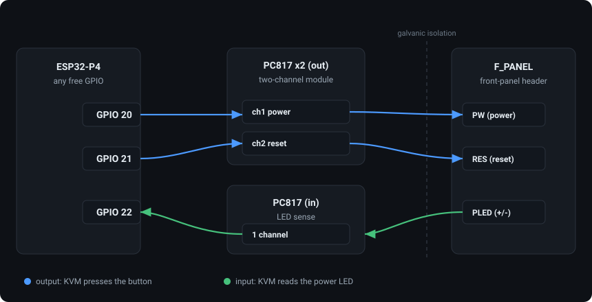

<!--
SPDX-FileCopyrightText: 2026 ESP-KVM contributors
SPDX-License-Identifier: Apache-2.0
-->

# ATX power control wiring

ESP-KVM can press the target PC's front-panel power and reset buttons and read
its power LED, so the console can turn the machine on, off, hard-off and reset,
and show whether it is running. None of it needs a custom board: two cheap
optocoupler modules and a few jumper wires do the job.

This is optional. With nothing wired, the firmware reports ATX as unavailable
and the console hides the controls. Everything below is set at runtime under
**Settings -> Power** - no rebuild to change a pin or fix a polarity.



## Why optocouplers

The target and the KVM must not share a ground through these signals: the front
panel switches sit at the motherboard's own reference, and tying the ESP32
directly to them risks ground loops and, if anything is miswired, the P4. An
optocoupler passes the signal as light, so the two sides stay electrically
isolated. A relay isolates too, and has no polarity to get wrong on the switch
side, but it cannot sense the LED - so an optocoupler is the one kind of part
that covers both directions. If you already own a relay board, see the section
below.

A **PC817 two-channel optocoupler module** (the small board with screw
terminals, about a euro) is all you need - one for the two outputs (power,
reset), one for the LED input. These are "high-level trigger" boards: driving
the input high turns the optocoupler on, which is the firmware default
(`atx_active_high` on). If yours presses on a low instead, flip that setting.

## A relay module instead

A two-channel relay board works for the power and reset buttons, and needs no
firmware change: the pins are driven the same way, and `atx_active_high` covers
a board that triggers on a low. Use one if that is what you have.

What it does not do is the third wire. A relay is a switch, so it cannot sense
the power LED - `atx_led_gpio` stays -1 and the console shows the controls
without a power state. Two other things to expect: the coils want a few tens of
milliamperes each, more than the P4 pin can give, so the board needs its own 5 V
(any relay module worth buying already drives the coil from a transistor), and
the contacts bounce for a millisecond or two on each press. A motherboard
debounces its own front-panel switch and will not care; if yours does something
odd on a press, that is the first suspect.

## The front-panel header

The buttons and LEDs are on the motherboard's front-panel header - the same
block the PC case's power button, reset button and LEDs plug into. Vendors name
and arrange it differently (`F_PANEL`, `PANEL1`, `JFP1`, ...), so there is no
single universal pinout; always read the silkscreen next to the header or the
motherboard manual.

As one example, a common layout groups the signals in two rows like this:

```
        (even pins)                 (odd pins)
   2  PW   power switch        1  PLED+  power LED anode
   4  PW   power switch        3  PLED-  power LED cathode
   6  RES  reset switch        5  HD+    HDD LED anode
   8  RES  reset switch        7  HD-    HDD LED cathode
                               9  NC
```

Yours may differ - confirm the exact pins before wiring.

Two things matter:

- **Power and reset are just switches.** Shorting the two pins is a press;
  there is no polarity to a contact. With an optocoupler output (a transistor),
  though, there *is* a polarity: the collector goes to the pin that reads a small
  positive voltage to ground (measure it with a multimeter on a plugged-in but
  powered-off machine), the emitter to the other.
- **Sense the power LED, not the HDD LED.** `HD` only blinks on disk activity;
  `PLED` tells you the machine is on. LEDs have polarity - wire `PLED+` to the
  module input's `+`, `PLED-` to its `-`.

Many motherboards drive the power LED through a modest series resistor, so a
stock PC817 input module (about 1 kohm in series) may only pass a milliamp or
two and read weakly. If the reported power state is unreliable, lower that
module's input resistor to ~220-330 ohm - the one place a soldering iron might be
needed.

## To the ESP32-P4

Each signal takes one GPIO. The two buttons arrive filled in with pins that are
free on the board the firmware was built for; the LED does not, because it is
the optional wire:

| Signal | Setting | Default GPIO |
|---|---|---|
| Power button output | `atx_pwr_gpio` | 46 |
| Reset button output | `atx_rst_gpio` | 47 |
| Power LED input | `atx_led_gpio` | unassigned - 48 is free for it (3 on the Guition) |

The LED is left unassigned on purpose. Its input is biased toward "off", so a
pin that nobody wired would report the target as powered down for ever, and no
reading is better than a wrong one. Set it when the third wire is actually
there.

Any other free pin does as well - the console's Pins tab draws the header of the
board it is running on, so you can see where the wire actually goes.

You cannot put two things on one pin: a setting naming a GPIO that the board's
own hardware holds, or that another setting is already using, is refused and
says which. The defaults are chosen not to collide with the status display's,
so a device wearing both needs nothing moved.

On the module, the `IN` terminals are the input (driven side) and the `V`
terminals are the output (switched side): for the two button channels the ESP32
drives `IN`, and `V` goes across the button pins; for LED sensing the power LED
drives `IN`, and the ESP32 reads `V`.

## Settings

Under **Settings -> Power**:

| Setting | Meaning | Default |
|---|---|---|
| `atx_enable` | Turn ATX control on | off |
| `atx_pwr_gpio` | Power button GPIO | 46 |
| `atx_rst_gpio` | Reset button GPIO | 47 |
| `atx_led_gpio` | Power LED sense GPIO | -1 (no sensing) |
| `atx_short_ms` | Normal press length | 200 ms |
| `atx_long_ms` | Hard-off hold length | 5000 ms |
| `atx_active_high` | Drive high to press (high-level-trigger module) | on |
| `atx_led_active_high` | LED reads high when the target is on | on |

Set the pins and turn `atx_enable` on; the power button at the bottom of the
console's side rail lights up.
If the target reacts to the wrong button, or the reported power state is
inverted, flip the matching polarity setting - no reflash.
